# Team 09 - Projekt Trading

## 📚 Table of Contents

- [Problem Definiton:](#problem-definiton)
- [Step 1 - Data Acquisition](#step-1---data-acquisition)
- [Step 2 - Data Understanding](#step-2---data-Understanding)
- [Step 3 - Data Preparation (Pre-Split)](#step-3---data-preparation-pre-split)
- [Step 4 - Split Data](#step-4---split-data)
- [Step 5 - Post-Split Preparation](#step-5---post-split-preparation)
- [Step 6 - Feature Selection](#step-6---feature-selection)
- [Step 7 - Model Training](#step-7---model-training)
- [Step 8 - Model Testing](#step-8---model-testing)
- [Step 9 - Model Deployment](#step-9---deployment)

---

### Problem Definiton:

**Target**

Ziel dieses Projekts ist die Vorhersage der Trendrichtung des Bitcoin-Preises in der nächsten Stunde.
Für die Modellierung werden stündliche Bitcoin-Daten im Zeitraum 01.01.2021 bis 01.11.2025 als Trainings- und Validierungsgrundlage verwendet.
Auf Basis dieser historischen Stundenwerte soll das Modell lernen, für jeden Zeitpunkt vorherzusagen, ob der Bitcoinpreis in der darauffolgenden Stunde steigt, fällt oder innerhalb eines definierten Schwellenwerts neutral bleibt.
Die Trendrichtung wird dabei anhand des prozentualen Preisreturns zwischen dem aktuellen und dem nachfolgenden Schlusskurs berechnet.
Bewegungen innerhalb einer kleinen Toleranzzone werden als neutral klassifiziert, um Marktrauschen zu reduzieren und stabile Labels zu erzeugen.

**Input features**

Das Modell verarbeitet pro Stunde eine Reihe Features, die Preisstruktur, Trend, Momentum und Cross-Asset-Information abbilden:
- Preis- und Volumenmerkmale: open, high, low, close, volume, VWAP (volumengewichteter Durchschnittspreis)
- Momentum-Merkmale: return_1h, return_6h, return_24h --> prozentuale Preisveränderung über 1, 6 Stunden bzw. 24 Stunden
- Trendindikatoren: EMA_6 und EMA_24 --> normalisierte exponentielle gleitende Durchschnitte
- RSI (Trendstärke-Indikator aus Preisänderungen)
- ATR (Maß für die Volatilität des Marktes)
- Cross-Asset-Features anhand von Ethereum: ETH_Close, ETH_return_1h, ETH_return_6h, ETH_return_24h, ETH/BTC Ratio (relative Stärke zwischen ETH und BTC)

### Procedure Overview:

- Datensammlung: Erhebung von stündlichen Bitcoin- und Ethereum-Daten im Zeitraum 01.01.2021 bis 01.11.2025
- Feature Engineering: Berechnung aller oben beschriebenen preis-, volumen-, trend- und momentumbezogenen Merkmale sowie Cross-Asset-Features.
- Labelgenerierung: Berechnung des 1-Stunden-Returns und Klassifikation der Trendrichtung in Up / Down / Neutral anhand einer Toleranzschwelle.
- Modelltraining: Training eines LSTM-Netzwerks, das aus 48-stündigen Sequenzen die Trendklasse der nächsten Stunde vorhersagt.

Zielsetzung: 
Die Analyse soll Muster in Preis-, Volumen- und Cross-Asset-Beziehungen identifizieren, die kurzfristige Trendbewegungen im Bitcoin-Markt vorhersagen.
Durch die Modellierung der Trendrichtung (Up/Down/Neutral) auf Basis historischer Daten sollen Entscheidungsgrundlagen geschaffen werden, um günstige Kauf- und Verkaufszeitpunkte zu erkennen und so potenziell profitablere Handelsentscheidungen zu ermöglichen.

In einem hypothetischen Trading-Kontext könnten diese Signale wie 
folgt interpretiert werden:
- Up → Kaufsignal
- Down → Verkaufssignal  
- Neutral → Keine Aktion (Position halten)

## Step 1 - Data Acquisition

Es werden Rohmarktdaten für Bitcoin und Ethereum extrahiert. Da Kryptowährungen rund um die Uhr gehandelt werden, ist keine Filterung nach Öffnungs- oder Schließzeiten erforderlich.

**Script**

[scripts/01_data_acquisition/01_data_acquisition.py](scripts/01_data_acquisition/01_data_acquisition.py)

Lädt stündliche, Kursbalken (OHLCV) für Bitcoin und Ethereum im Zeitraum vom 01.01.2024 bis zum 01.11.2025 und speichert die Daten als Parquet-Dateien.
Im nächsten Schritt werden die Bitcoin-Daten mit dem Ethereum-Schlusskurs über den gemeinsamen Zeitstempel gemergt, sodass der ETH-Close-Wert als zusätzliches Feature zur Verfügung steht.

Bar data example:

 

---

## Step 2 - Data Understanding

Analyse historischer BTC-Preisdaten, um die Struktur, Eigenschaften und das Verhalten der Zeitreihe zu verstehen.
Ziel ist es, wichtige statistische Abhängigkeiten, sich wiederholende Muster und Besonderheiten zu identifizieren, die die Auswahl der Merkmale und die Architektur des Modells beeinflussen.

Bei der Datenprüfung konnten keine fehlenden Werte (NA/NaN) festgestellt werden.

**Data Columns**

| Column              | Description                                                                            |
|---------------------|----------------------------------------------------------------------------------------|
| timestamp           | Der genaue Zeitpunkt (UTC), zu dem die stündliche Kerze geschlossen wurde - Zeitindex. |
| open (float)        | Der BTC-Preis zu Beginn des Stundenintervalls.                                         |
| high (float)        | Der höchste BTC-Preis, der während dieser Stunde erreicht wurde.                       |
| low (float)         | Der niedrigste BTC-Preis, der während dieser Stunde erreicht wurde.                    |
| close (float)       | Der BTC-Preis am Ende des Stundenintervalls (Zielvariable).                            |
| volume (float)      | Das gehandelte BTC-Volumen während der Stunde - Marktaktivität.                        |
| trade_count (float) | Anzahl der ausgeführten Trades innerhalb einer Stunde.                                 |
| vwap (float)        | Volumengewichteter Durchschnittspreis für die Stunde.                                  |
| eth_close (float)   | Der stündliche Schlusskurs von Ethereum (ETH).                                         |

**Descritive Statistics**

| Statistic    | open          | high          | low           | close          | volume       | trade_count   | vwap           | eth_close    |
|--------------|---------------|---------------|---------------|----------------|--------------|---------------|----------------|--------------|
| count        | 42339.000000  | 42339.000000  | 42339.000000  | 42339.000000   | 42339.000000 | 42339.000000  | 42339.000000   | 42339.000000 |
| mean         | 53085.164609  | 53295.084529  | 52861.723574  | 53084.377853   | 78.447927    | 1775.976806   | 52159.513397   | 2513.903310  |
| std          | 29053.359436  | 29126.455657  | 28982.046140  | 29052.349537   | 180.463969   | 3234.410173   | 29774.942871   | 920.348506   |
| min          | 15627.650000  | 15750.440000  | 8200.000000   | 15631.840000   | 0.000000     | 0.000000      | 0.000000       | 722.000000   |
| 25%          | 29218.204031  | 29298.214064  | 29133.980952  | 29216.630861   | 0.015927     | 5.000000      | 28437.060330   | 1771.182339  |
| 50% (median) | 44716.370000  | 44988.310000  | 44444.480000  | 44728.140000   | 7.310082     | 530.000000    | 43825.937372   | 2405.479000  |
| 75%          | 66949.332500  | 67166.909250  | 66729.690465  | 66939.260000   | 72.199770    | 2395.500000   | 66653.792593   | 3231.658500  |
| max          | 126093.044500 | 126262.032000 | 125280.720000 | 126117.150000  | 5213.685947  | 110487.000000 | 125566.851844  | 4933.850000  |

Die Werte zeigen eine große Bandbreite sowohl bei den BTC-Preisschwankungen als auch bei den Volumen- und Handelsaktivitätsindikatoren.

- Preise (OHLC): der durchschnittliche BTC-Preis liegt bei etwa 53.000 USD, jedoch mit einer sehr hohen Standardabweichung von etwa 29.000 USD, was auf starke langfristige Marktbewegungen hindeutet. Der Tiefstwert von 8.200 US-Dollar und der Höchstwert von über 126.000 US-Dollar zeigen eine enorme Volatilität im betrachteten Zeitraum.
- Volumen und Trade Count: das Handelsvolumen weist eine stark asymmetrische Verteilung auf: der Median liegt bei nur 7,31, während der Höchstwert bei über 5200 liegt. Auch die Anzahl der Transaktionen variiert stark, und zwar von 0 bis zu über 110.000 pro Stunde. Dies deutet auf große Unterschiede in der Marktaktivität zwischen ruhigen und hochvolatilen Phasen hin.
- VWAP: der durchschnittliche VWAP liegt bei 52.159 USd und schwankt ähnlich wie die anderen Preisvariablen, was eine stabile Preisstruktur bestätigt.
- ETH Close: der durchschnittliche Schlusskurs von ETH liegt bei etwa 2514 US-Dollar, ebenfalls mit einer hohen Streuung. Dies bestätigt, dass auch der ETH-Markt während des Analysezeitraums starken Schwankungen unterworfen war.

Insgesamt zeigen die Werte eine hohe Volatilität, große Unterschiede in der Marktaktivität und starke Preisschwankungen. Diese Merkmale sind für die nachfolgende Modellierung wichtig und bestätigen die Zweckmäßigkeit der Wahl des LSTM-Modells.

**Script**

[scripts/02_data_understanding/plotter.py](scripts/02_data_understanding/plotter.py)

**Plots**

*1) Entwicklung des BTC-Schlusskurses über den gesamten Zeitraum 2024–2025 vs 2021-2025*

Dieses Diagramm zeigt die langfristige Entwicklung des Schlusskurses von BTC über den gesamten Beobachtungszeitraum. Es ermöglicht die Darstellung der Gesamtstruktur einer Zeitreihe.

 

Ursprünglich haben wir einen Chart mit den Schlusskursen von BTC nur für den Zeitraum 2024–2025 erstellt.
In diesem Zeitraum war jedoch fast ausschließlich ein anhaltender Aufwärtstrend ohne nennenswerte Korrekturen zu beobachten.
Damit das Modell nicht nur auf Wachstumsphasen des Marktes trainiert werden konnte, haben wir den Zeitrahmen auf 2021–2025 erweitert.

 

Dieser Bereich umfasst starke Preisrückgänge, beispielsweise den starken Einbruch, der im Dezember 2021 einsetzte, wodurch das Modell verschiedene Marktbedingungen berücksichtigen kann.

*2) Durchschnittlicher BTC-OHLC-Verlauf und Handelsvolumen pro Stunde (auf Basis des letzten Jahres)*

Wir untersuchen den Durchschnittswert von BTC-OHLC für das letzte Jahr in stündlichen Intervallen. Außerdem wird das durchschnittliche Handelsvolumen pro Stunde angezeigt.
Das Diagramm hat zwei Y-Achsen:
- linke Achse: Preis (Eröffnung, Maximum, Minimum, Schlusskurs)
- rechte Achse: durchschnittliches Handelsvolumen Die X-Achse zeigt die Zeit an, wobei jeder Punkt den Durchschnittswert für diese Stunde während des gesamten Jahres darstellt.

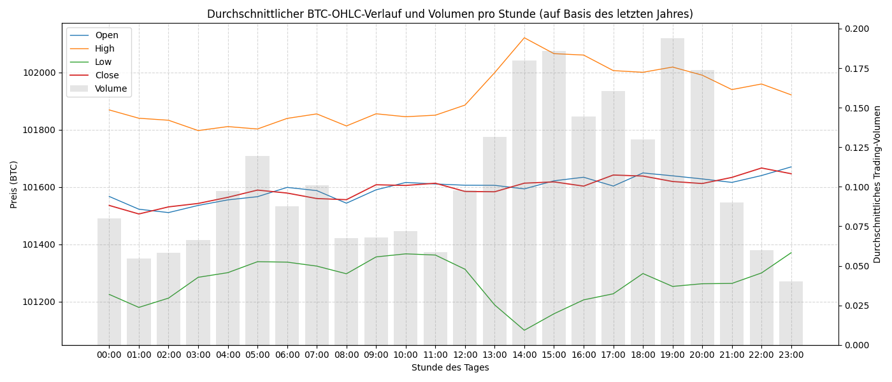

Es ist ersichtlich, dass sich die Eröffnungs- und Schlusskurse relativ stabil entwickeln, ohne große Schwankungen zwischen den Stunden. Die Höchst- und Tiefstkurse weisen jedoch zu bestimmten Tageszeiten erhebliche Schwankungen auf. Das Handelsvolumen korreliert teilweise mit diesen Schwankungen, steigt jedoch nicht immer synchron an.
Eine große Bandbreite von Höchst- und Tiefstwerten bedeutet eine erhöhte Volatilität, die oft ein Indikator für eine Trendwende oder stärkere Bewegungen ist.

*3) Durchschnittlicher stündlicher High–Low-Range von BTC (auf Basis des letzten Jahres)*

Dieser Graph zeigt den durchschnittlichen Unterschied zwischen High und Low („Range“) pro Stunde. Jede Markierung steht für eine Stunde des Tages und zeigt, wie volatil der BTC-Preis im Durchschnitt ist.

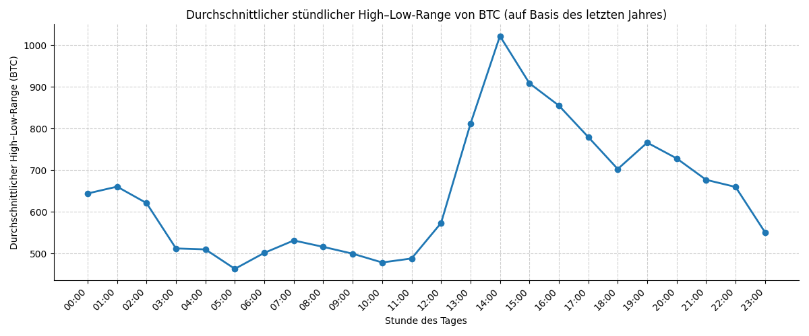

Es gibt eine deutlich erkennbare Volatilitätsphase zwischen 13:00 und 17:00 Uhr. Der Bereich nimmt dort stark zu und erreicht sein Tageshoch, bevor er nach 18:00 Uhr wieder abnimmt. Dies spiegelt erneut die hohe Volatilität des Marktes wider.
In Stunden mit einem hohen durchschnittlichen Bereich ist die Wahrscheinlichkeit, dass der Schlusskurs deutlich fällt oder steigt, höher,  d. h. es gibt ein stärkeres Signal für die Klassifizierung „aufwärts/abwärts”.

*4) Veränderung der BTC/ETH-Close-Preise über den letzten Tag*

Das Diagramm zeigt den durchschnittlichen stündlichen Schlusskurs (Close) für BTC und ETH in den letzten 30 Tagen.
Das Diagramm hat zwei Y-Achsen:
- links: BTC Close
- rechts: ETH Close Die Punkte geben den Durchschnittswert pro Stunde an.

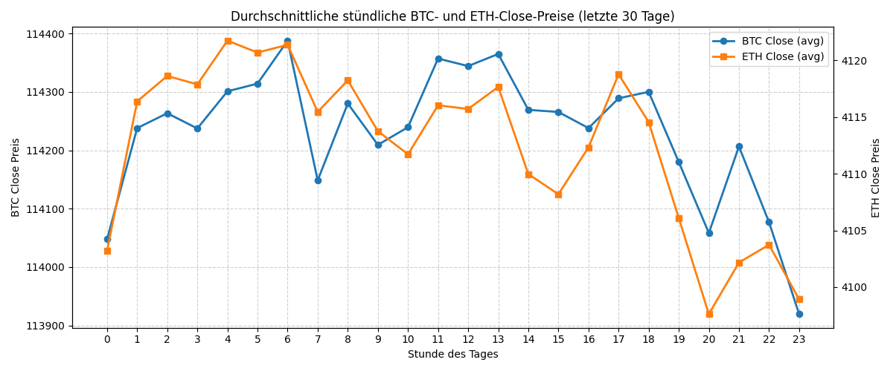

BTC und ETH weisen sehr ähnliche Kurven auf. Beide Kritowährungen steigen und fallen oft synchron.
Die starke Parallelität deutet auf eine hohe Korrelation zwischen BTC und ETH hin. 
Dies deutet darauf hin, dass die ETH-Daten als zusätzliche Funktionen tatsächlich nützlich sind, um das LSTM-Modell zu verbessern.

*5) Korrelation zwischen BTC und ETH (letzte 30 Tage)*

Dieses Diagramm ist ein Streudiagramm, in dem jeder Punkt ein Wertepaar aus BTC_close und ETH_close zur gleichen Uhrzeit darstellt.
Wir haben dieses Diagramm erstellt, um endgültig zu bestätigen, dass ETH ein nützliches zusätzliches Merkmal für das Modell ist.

Auf dem Diagramm ist deutlich zu erkennen, dass die Datenpunkte entlang einer aufsteigenden Linie konzentriert sind.
Dies deutet auf eine sehr starke positive lineare Abhängigkeit zwischen BTC und ETH hin.
Der berechnete Pearson-Korrelationskoeffizient r = 0,96 bestätigt diese Abhängigkeit zusätzlich.

---

## Step 3 - Data Preparation (Pre-Split)

**Script**

- [scripts/03_pre_split_prep/features.py](scripts/03_pre_split_prep/features.py)
- [scripts/03_pre_split_prep/targets.py](scripts/03_pre_split_prep/targets.py)
- [scripts/03_pre_split_prep/main.py](scripts/03_pre_split_prep/main.py)
- [scripts/03_pre_split_prep/plot_features.py](scripts/03_pre_split_prep/plot_features.py)

### Features Berechnung

Folgende Features werden in dem Skript features.py berechnet. 

**Data Columns**

| Column                   | Description                                                                                                                                  | Purpose                                                                                                                |
|--------------------------|----------------------------------------------------------------------------------------------------------------------------------------------|------------------------------------------------------------------------------------------------------------------------|
| btc_return (1h, 6h, 24h) | Prozentualer Preisänderung des Close Preises in den letzten 6h, 24h oder der letzten Stunde.                                                 | Erkennen von kurz-, mittelfristigen Trends sowie Tagestrends                                                           |
| eth_return (1h, 6h, 24h) | Prozentualer Preisänderung des Close Preises von Ethereum in den letzten 6h, 24h oder der letzten Stunde.                                    | Korrelierte Märkte -> ETH kann früher und stärker reagieren als BTC                                                    |
| eth_btc_ratio            | Relative Stärke von Ethereum Close Preis gegenüber Bitcoin Close Preis                                                                       | Cross-Asset -> zeigt, ob ETH stärker oder schwächer als BTC performt → Hinweis auf Marktstimmung                       |
| ema_6 und ema_24         | Exponentiell gewichteter gleitender Durchschnitt, wobei neuere Close Preise von Bitcoin mehr Gewicht bekommen                                | Trendindikatoren reagieren schnell auf Marktveränderungen -> Erkennt ob der Trend aktuell beschleunigt oder abschwächt |
| rsi                      | Momentum-Indikator, berechnet über die letzten 24 Stunden -> zeigt on Markt überkauft oder überverkauft ist                                  | Erkennung von Marktphase (überkauft, überverkauft) hilft Wendepunkte im Markt zu erkennen                              |
| atr_24                   | Volatilität -> Misst, wie stark sich der Bitcoin-Preis über die letzten 24 Stunden durchschnittlich bewegt hat, relativ zum aktuellen Preis. | Wichtig für volatilitätsbasierten Toleranzzone                                                                         |

### Target Berechnung

Das Projekt hat das Ziel, die Trendrichtung des Bitcoin-Schlusskurses für die jeweils nächste Stunde vorherzusagen. Die Trendrichtung wird dabei in drei Klassen eingeteilt:

- UP: 2
- Neutral: 1
- DOWN: 0

Der Trendwert in einer Zeile zum Zeitpunkt t beschreibt die Kursbewegung von t bis t+1. Die Klassifizierung erfolgt auf Grundlage des stündlichen Returns btc_return_1h, der in der Zeile t+1 steht.

- Ist btc_return_1h(t+1) > 0, wird die Klasse UP vergeben.
- Ist btc_return_1h(t+1) < 0, wird die Klasse DOWN vergeben.
- Liegt der Wert innerhalb einer definierten Toleranzzone, wird die Klasse NEUTRAL vergeben.

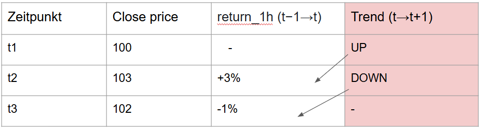

Die Toleranzzone ist dabei nicht statisch, sondern wird dynamisch an die aktuelle Marktvolatilität angepasst.
Dazu wird die typische Tagesvolatilität anhand des ATR(24h)-Indikators geschätzt.

Ein Trend wird als neutral klassifiziert, wenn:
∣btc_return_1h(t+1)∣ < 0.25×ATR24​(t)

Das bedeutet: Bewegungen, die weniger als 25 % der typischen täglichen Volatilität ausmachen, gelten als marktübliches Rauschen und werden nicht als richtungsstarker Trend gewertet.

Nach der Features und Target Generierung werden NaN Werte entfernt, die durch das Feature Engineering entstanden sind.

### Deskriptive Statistiken

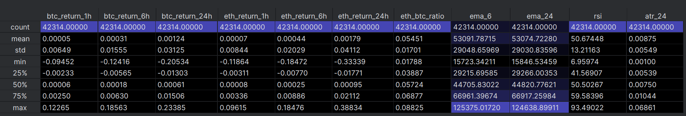

- BTC- und ETH-Returns haben kleine Mittelwerte (≈ 0) 
- Die Standardabweichung steigt mit längeren Zeitfenstern (1h < 6h < 24h) → je größer das Zeitintervall, desto größer die erwartete Schwankung.
- ETH ist volatiler als BTC → die Standardabweichungen von ETH-Returns sind in jedem Zeitfenster höher als bei BTC.
- Die Return-Verteilungen zeigen deutliche Ausreißer (z. B. bei 24-h-Returns: max ≈ +0.23, min ≈ −0.20), was auf starke Marktbewegungen hinweist
- Der RSI liegt im Durchschnitt bei ~50, was bedeutet, dass der Markt über den Gesamtzeitraum weder signifikant überkauft (>70) noch überverkauft (<30) war
- Indikatoren wie EMA (6h/24h) haben hohe Werte, da sie direkt auf dem BTC-Preis basieren, was ihre Skalierung von Returns klar unterscheidet

### Visualisierung 

**Plots**

*1) Trendverteilung des Bitcoin-Marktes im Zeitverlauf (2-Monats-Intervalle)*

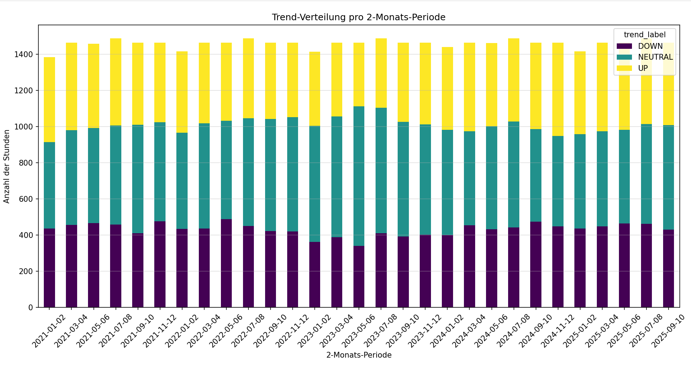

- Jede Säule zeigt, wie viele Stunden innerhalb eines 2-Monats-Fensters als UP, DOWN oder NEUTRAL klassifiziert wurden.
- Die Verteilung bleibt über die Jahre stabil
- keine strake Dominanz einer bestimmten Trendklasse
- Beim Splitten der Daten sollten alle Trendklassen sowohl im Trainings- als auch im Validierungsdatensatz ausreichend vertreten sein

*2) Entwicklung der Bitcoin-Volatilität (ATR-24h) von 2021 bis 2025)*

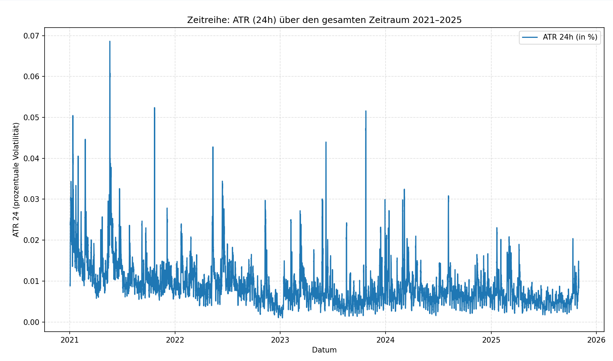

- Zeigt die tägliche prozentuale Volatilität von Bitcoin gemessen über ein 24-Stunden-Fenster
- Hohe Ausschläge markieren Phasen starker Marktbewegungen, während ruhige Perioden niedrige ATR-Werte zeigen.
- Die Grafik verdeutlicht, dass die Volatilität langfristig abnimmt, mit vereinzelten starken Peaks

*3) Zusammenhang zwischen BTC- und ETH-Returns*

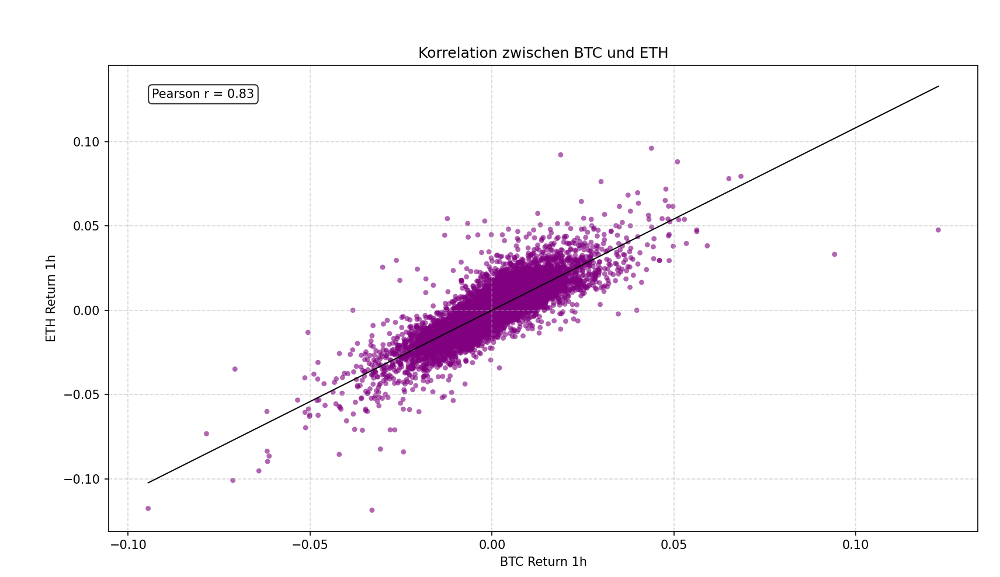

- Zeigt die lineare Beziehung zwischen stündlichen BTC- und ETH-Returns.
- Die deutliche Aufwärtswolke und der Pearson-Korrelationswert (r = 0.83) deuten auf eine sehr starke positive Korrelation hin.
- Daraus lässt sich schließen: Steigt BTC, steigt ETH typischerweise ebenfalls.

*4) Rolling Lag-Korrelation zwischen ETH und BTC Returns (zeitversetzt um 1 Stunde)*

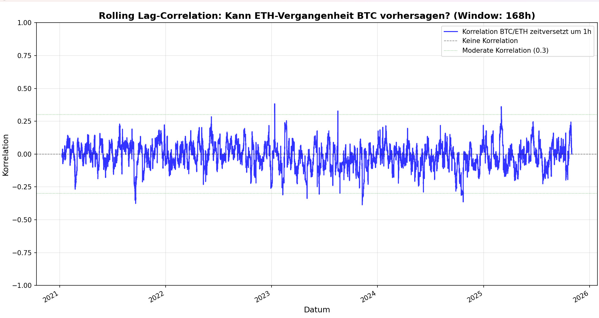

- Zeigt, ob vergangene ETH-Returns (lagged um 1h) Bewegungen im BTC-Return vorhersagen können.
- Die Korrelation bleibt über alle Jahre sehr nahe bei 0 – kaum systematischer Zusammenhang erkennbar.
- Positive oder negative Ausreißer treten nur kurzfristig auf und wirken zufällig, nicht strukturell.
- ETH Return nicht hilfreich bei der Vorhersage der zuküngtigen BTC Entwicklung

*5) Rolling Lag-Korrelation zwischen BTC und BTC Returns (zeitversetzt um 1 Stunde)*

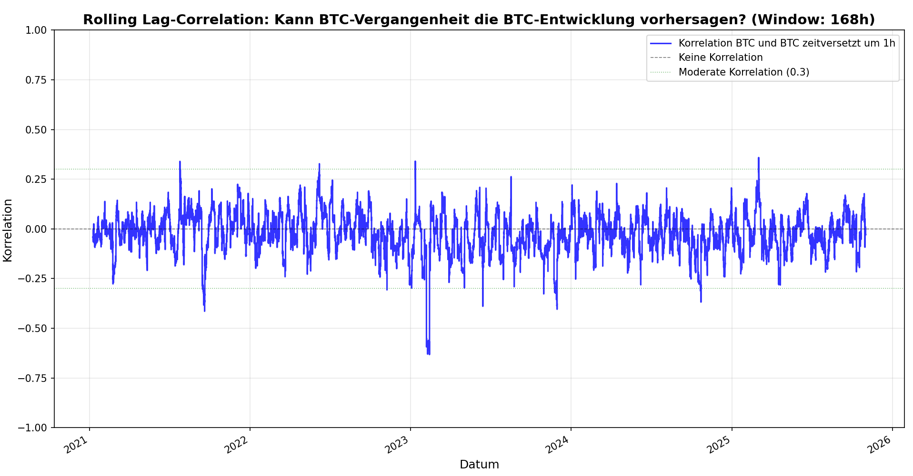

- Zeigt, wie stark der BTC-Return der letzten Stunde mit dem BTC-Return der aktuellen Stunde zusammenhängt.
- Die Korrelation schwankt um 0, was zeigt, dass Vergangenheits-BTC kaum Einfluss auf die nächste Stunde hat.
- Es gibt keine stabilen positiven oder negativen Muster, daher liefern lagged BTC-Returns keine sinnvolle Vorhersagekraft.
- Die gleiche Analyse wurde durchgeführt, wo BTC-Return um 12 und um 24 Stunden zurückversetzt wurde. Auch bei diesen Analysen ließen sich keine Zusammenhänge feststellen.

*6) EMA-Differenz (6h–24h) und BTC-Return (1h) im Vergleich über die letzten 12 Monate*

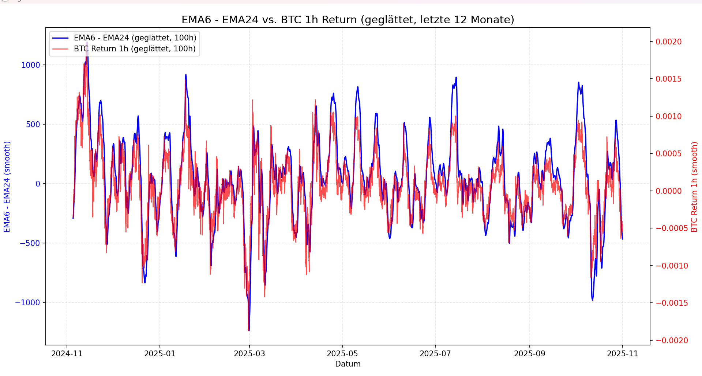

- EMA-Differenz als Trendindikator: Positive Werte zeigen kurzfristige Aufwärtsdynamik, negative Werte eine kurzfristige Trendabschwächung.
- BTC-Returns folgen ähnlichen Mustern: Geglättete Returns bewegen sich häufig in dieselbe Richtung wie die EMA-Differenz
- Zusammenhang zwischen EMA-Differenz und BTC-Return erkennbar

---

## Step 4 - Split Data

**Script**

[scripts/04_split_data/split.py](scripts/04_split_data/split.py)

Die Daten werden aufgeteilt in:
- Trainingsdaten (ca. 70% der Daten) - 2021-01-02 bis 2024-05-19
- Validierungsdaten (ca. 20% der Daten) - 2024-05-20 bis 2025-05-07
- Testdaten (ca. 10% der Daten) - 2025-05-08 bis 2025-10-31

Weiterhin wurde die letzte Zeile aus dem Trainingsdatensatz entfernt, da zur Berechnung der Target Variablen der letzten Zeile t
Informationen aus der Datenzeile t + 1 miteingeflossen sind. Diese Datenzeile befindet sich jedoch im Validierungsdatensatz -> Data Leakage
Aus dem gleichen Grund wurde auch die letzte Zeile des Validierungsdatensatzes entfernt.

---

## Step 5 - Post-Split Preparation

**Script**

[scripts/05_post_split/05_normalize_features.py](scripts/05_post_split/05_normalize_features.py)

Alle Feature-Daten werden mit dem StandardScaler normalisiert. 
Dabei wird der Skalierer nur auf den Trainingsdaten gelernt und anschließend auf Validierungs- und Testdaten angewendet, um Datenleckage zu vermeiden. 
Durch die Standardisierung liegen alle Features auf einem ähnlichen Wertebereich, was das Training stabiler macht und verhindert, dass einzelne Merkmale das Modell dominieren. 
Die Zielvariable wird nicht normalisiert, weil es sich um Klassenlabels handelt – sie stehen für diskrete Kategorien (steigend, fallend, neutral) und dürfen deshalb nicht skaliert werden.

---

## Step 6 - Feature Selection

**Script**

[scripts/06_feature_selection/main.py](scripts/06_feature_selection/main.py)

Es wird eine Korrelationsmatrix erstellt, um Features zu ermitteln, die stark miteinander korrelieren und somit redundant sind. 
Dadurch lassen sich Merkmale identifizieren, die hauptsächlich dieselben Informationen enthalten und das Modell nicht zusätzlich verbessern. 
Solche Features können anschließend entfernt werden, um Overfitting zu vermeiden.

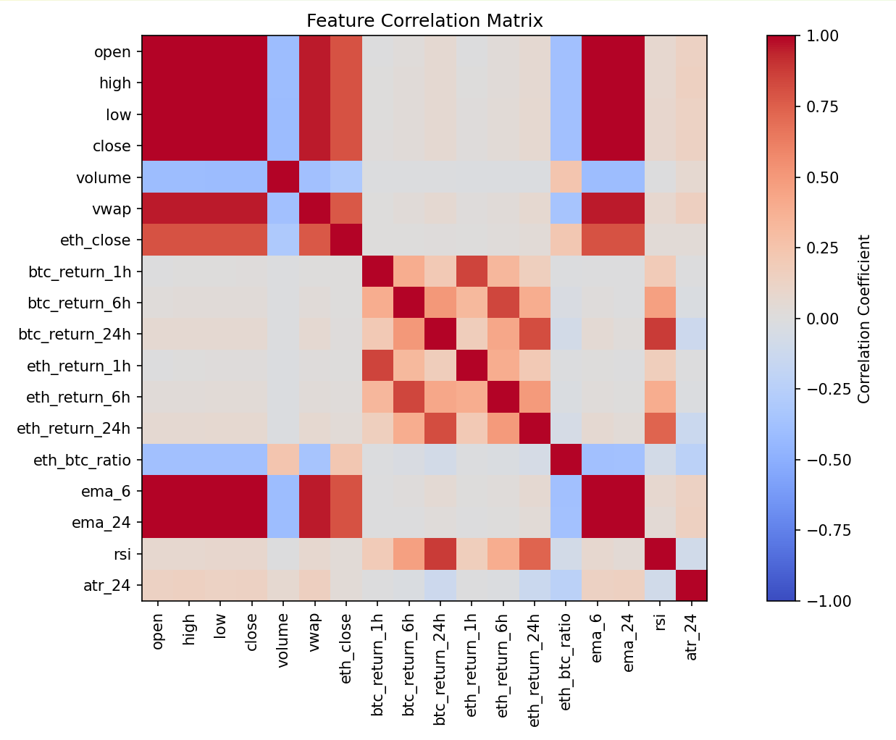

Aufgrund der starken Korrelationen werden folgende Features aus dem Datensatz gelöscht:
- open
- high
- low
- vwap
- eth_close

*Ausgewählte und skalierte Features*

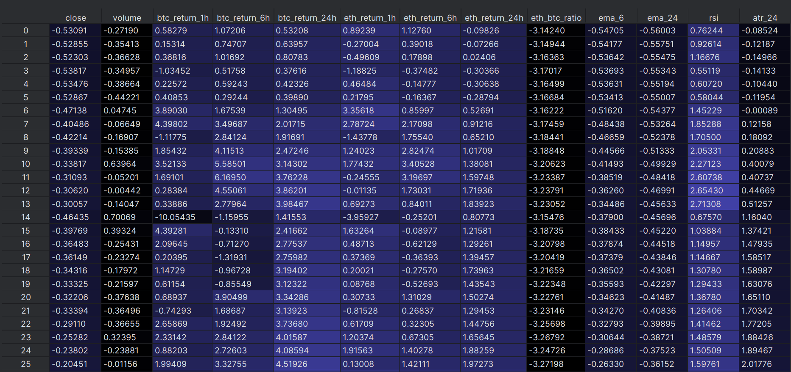

---

## Step 7 - Model Training

**Script**

- [scripts/model_training/BTCSequenceDataset.py](scripts/model_training/BTCSequenceDataset.py)
- [scripts/model_training/LSTM_Pytorch.py](scripts/model_training/LSTM_Pytorch.py)
- [scripts/model_training/random_forest.py](scripts/model_training/random_forest.py)
- [scripts/model_training/random_loss.py](scripts/model_training/random_loss.py)

*Nutzung LSTM-Modell*

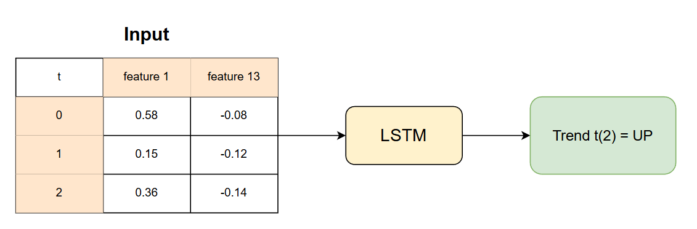

- Einsatz eines LSTM-Modells zur Vorhersage des kurzfristigen Bitcoin-Trends
- Modell erhält Sequenzen historischer Feature-Werte, die den zeitlichen Verlauf des Marktes beschreiben
- LSTM verarbeitet diese Werte Schritt für Schritt und speichert relevante Muster im internen Zustand
- Ausgabe einer Klassifikation des Trends (steigend, fallend, neutral)

Vorteile der Nutzung von LSTM:

- Erkennung von Mustern über mehrere Stunden -> Erkennung von zeitlichen Abhängigkeiten
- Speichert relevante Informationen im Verlauf

*Modellarchitektur*
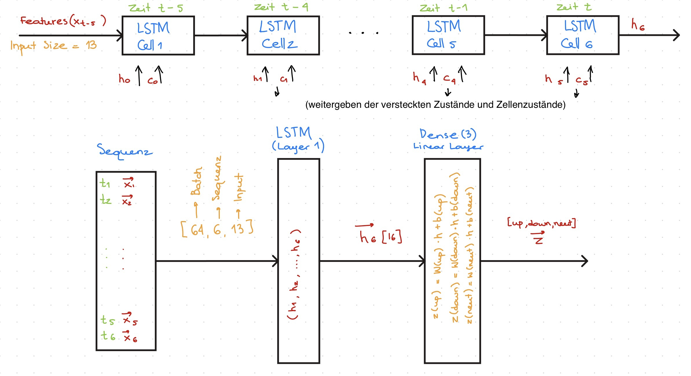

- Cell: in jedem Schritt einer Sequenz erhalten wir Features, den Zustand des Langzeitgedächtnisses (c) und den Zustand des Kurzzeitgedächtnisses (h), c und h werden an den nächsten Schritt weitergegeben.
- Input Sequence: die Sequenz aus 6 Schritten (6 Stunden) wird in den Input der LSTM-Schicht eingegeben, wobei jede Zelle einen Vektor aus 13 Merkmalen x zum Zeitpunkt t darstellt. In die LSTM-Schicht werden 64 Sequenzen (batch size) mit einer Größe von jeweils 6 Stunden eingegeben, wobei jede Stunde 13 Features überträgt.
- LSTM-Layer: das Modell enthält eine LSTM-Schicht. Diese verarbeitet nacheinander sechs Zeitschritte. Bei jedem Schritt aktualisiert die LSTM den versteckten Zustand h und den Zellzustand c. Nach Durchlaufen der gesamten Sequenz wird der letzte versteckte Zustand h6 genommen – dies ist ein Vektor, der 16 Neuronen (hidden size) enthält.
- Dense(3): das final hidden state h6 wird an eine lineare Layer weitergeleitet, die aus drei unabhängigen linearen Ausgängen besteht (up, down, neutral). Jeder Ausgang wird berechnet: z=W*h6 +b, wo W — Gewichtsmatrix 3*16, die bestimmt, wie jedes Neuron aus dem Vektor h6 die Wahrscheinlichkeit jeder der drei Klassen beeinflusst.

Hinweis: Für unser Modell haben wir die Softmax-Funktion nicht als zusätzliche Layer hinzugefügt, da wir für das Training die CrossEntropyLoss-Funktion verwenden. In PyTorch ist die Softmax-Funktion bereits in CrossEntropyLoss enthalten, das rohe Logits erwartet.

*Trainingsablauf des LSTM-Modells*

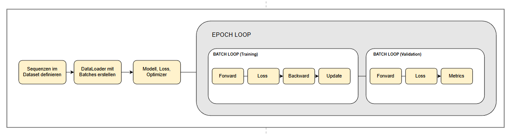

- Sequenzen im Dataset definieren: Aus den Zeitreihendaten werden überlappende Fenster erzeugt, die als Input-Sequenzen für das Modell dienen.
- DataLoader mit Batches erstellen: Die Sequenzen werden zu Batches zusammengefasst, damit das Modell in jedem Schritt mehrere Beispiele parallel verarbeiten kann. Für das Training werden die Sequenzen geshuffelt.
- Modell, Loss, Optimizer: Initialisierung des LSTM-Modells, Auswahl der Fehlerfunktion und Konfiguration des Optimizers zur Gewichtsaktualisierung.

Epoch Loop: Wiederholt Training und Validierung über mehrere Durchläufe, bis die Epochezahl erreicht ist.

Batch Loop (Training)
- Forward: Das LSTM verarbeitet die Sequenz und erzeugt eine Klassifikationsvorhersage für den Trend am letzten Zeitschritt.
- Loss: Die Vorhersage wird mit den echten Labels verglichen, um den Fehler des Modells zu berechnen.
- Backward: Per Backpropagation werden die Gradienten berechnet, die zeigen, wie stark jedes Gewicht zum Fehler beigetragen hat.
- Update: Der Optimizer passt die Modellgewichte basierend auf den Gradienten an.

Batch Loop (Validation)
- Forward: Die Validierungsdaten werden einmal durch das Modell geleitet, ohne die Gewichte zu verändern.
- Loss: Berechnung des Validierungsfehlers, um die Generalisierungsfähigkeit des Modells zu beurteilen.
- Metrics: Berechnung von Qualitätskennzahlen wie Accuracy, Recall oder F1-Score, um die Modellleistung zu vergleichen.

### Benutzte Parameter

| Parameter                 | Versuch 1          | Versuch 2                   | Versuch 3                   | Versuch 4                   | Versuch 5        | Versuch 6        | Versuch 7        | 
|---------------------------|--------------------|-----------------------------|-----------------------------|-----------------------------|------------------|------------------|------------------|
| Anzahl der Layer          | 2                  | 3                           | 3                           | 2                           | 2                | 2                | 2                | 
| hidden_size               | 16                 | 32, 16                      | 32, 16                      | 16                          | 16               | 16               | 16               | 
| Optimierungsalgorithmus   | SGD-Optimizer      | SGD-Optimizer               | SGD-Optimizer               | SGD-Optimizer               | SGD-Optimizer    | SGD-Optimizer    | Adam             | 
| LOSS Funktion             | CrossEntropyLoss   | CrossEntropyLoss            | CrossEntropyLoss            | CrossEntropyLoss            | CrossEntropyLoss | CrossEntropyLoss | CrossEntropyLoss | 
| Sequence size             | 6                  | 6                           | 24                          | 6                           | 6                | 6                | 6                | 
| Batch size                | 64                 | 64                          | 32                          | 64                          | 64               | 64               | 64               | 
| Dropout                   | kein               | vor dem letzten Layer (0.2) | vor dem letzten Layer (0.2) | vor dem letzten Layer (0.2) | kein             | kein             | kein             | 
| Learning Rate             | 0.00001            | 0.00001                     | 0.00001                     | 0.00001                     | 0.01             | 0.001            | 0.001            | 
| Aktivierungsfunktion      | keine              | keine                       | keine                       | keine                       | keine            | keine            | keine            | 
| ------------------------- | ------------------ | ---------------             | ---------------             | ---------------             | --------------   | ---------------  | ---------------  | 
| Train Loss                | 1.0866             | 1.0879                      | 1.0867                      | 1.0898                      | 1.0498           | 1.0702           | 1.0324           | 
| Val Loss                  | 1.0966             | 1.0967                      | 1.0969                      | 1.1066                      | 1.0934           | 1.0866           | 1.1159           | 
| Accuracy                  | 0.363              | 0.365                       | 0.366                       | 0.323                       | 0.396            | 0.397            | 0.363            | 
| F1-macro                  | 0.205              | 0.178                       | 0.179                       | 0.286                       | 0.355            | 0.324            | 0.362            |
| Recall-macro              | 0.334              | 0.333                       | 0.333                       | 0.333                       | 0.380            | 0.377            | 0.367            |

Die Ergebnisse der sieben Modellvarianten zeigen, dass die Wahl der Parameter in diesem Experiment nur zu moderaten Abweichungen in der Modellqualität führt. 
Die Loss-Werte bewegen sich über alle Versuche hinweg sehr nahe am Zufallsniveau, was darauf hindeutet, dass das Modell zwar erste Muster in den Daten erkennt, die Prognosekraft aber insgesamt noch gering ist. 
Besonders deutlich wird dies in den Klassifikationsmetriken: Die Accuracy liegt bei allen Versuchen im Bereich von 32–40 %, während F1-Score und Recall nur begrenzt ansteigen und damit eine starke Klassenverzerrung zugunsten der dominanten Klasse vermuten lassen. 
Insgesamt deuten die Ergebnisse darauf hin, dass Architekturänderungen am LSTM aktuell weniger Einfluss haben als die Datenbasis und das Feature-Design, sodass weitere Verbesserungen eher über das Feature Engineering zu erwarten sind.

- Accuracy: misst den Anteil aller korrekt vorhergesagten Klassen im Verhältnis zu allen Vorhersagen
- F1-Score (macro): misst die Balance zwischen Precision und Recall über alle Klassen und gewichtet alle Klassen gleich, unabhängig von ihrer Häufigkeit
- Recall (macro): misst den Anteil korrekt erkannter tatsächlicher Klassen (True Positives) im Verhältnis zu allen echten Fällen, ebenfalls gleich gewichtet über alle Klassen -> wie gut wird jede Klasse erkannt

Der Loss-Wert misst, wie gut das Modell die echten Zielwerte vorhersagt. 
Ein niedriger Loss bedeutet, dass die Modellvorhersagen nah an den tatsächlichen Klassen liegen, während ein hoher Loss zeigt, dass das Modell noch weit von korrekten Vorhersagen entfernt ist.

Ein zufälliger Klassifikator hätte bei dieser Klassenverteilung einen Loss von ca. 1.09. Dieser Wert dient als Baseline, um zu prüfen, ob das trainierte Modell besser als reiner Zufall vorhersagt.

#### Darstellung ausgewählter Versuche

*1.Versuch*

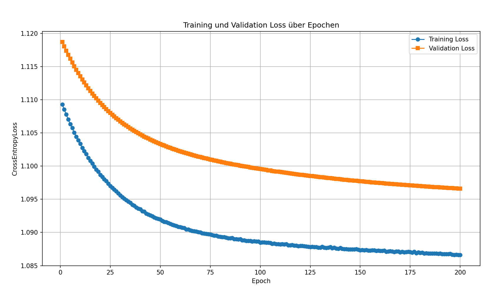

- Erfolgreiche Konvergenz: Beide Loss-Kurven (Training und Validation) fallen stetig
- Kein Overfitting: Die Validation Loss bleibt durchgehend leicht über der Training Loss und folgt dem gleichen Trend, was auf gute Generalisierung hindeutet
- Validation Loss schlechter als zufälliger Klassifikator 

*3.Versuch*

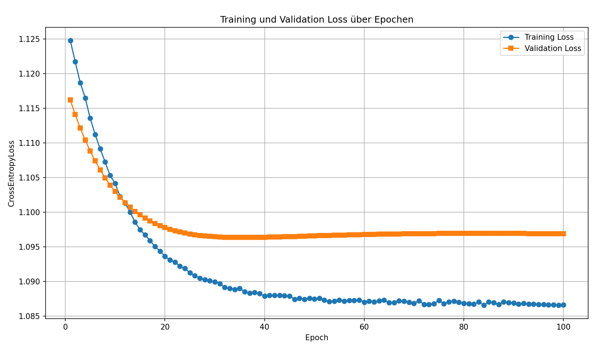

- Schnelle initiale Konvergenz: Beide Loss-Kurven fallen in den ersten 20-30 Epochen steil ab, danach verlangsamt sich die Verbesserung deutlich
- Tieferes Modell mit mehr Layern und einer größeren hidden_size sowie eine größere Sequenzlänge, verbessert die Modellqualität nicht
- Loss-Werte und andere Metriken minimal schlechter als im ersten Versuch und schlechter als zufälliger Klassifikator

*4.Versuch*

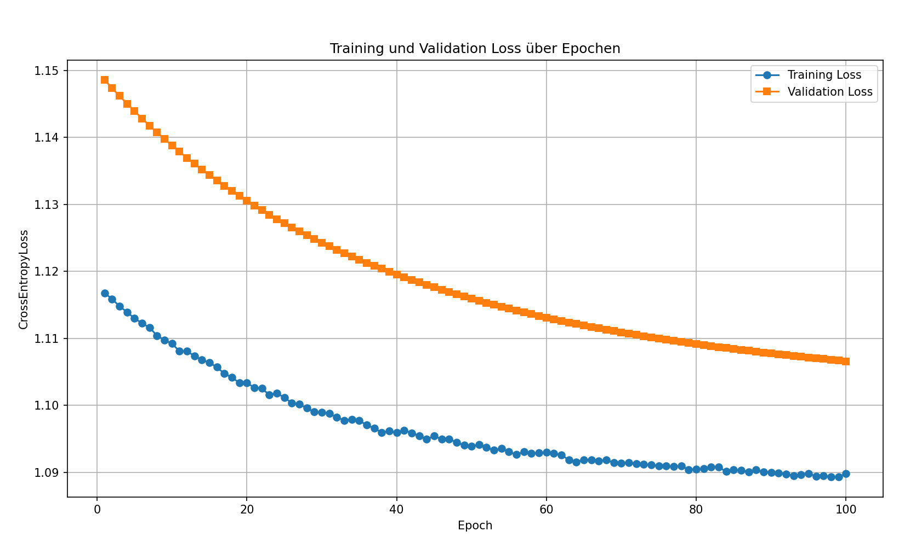

- Kontinuierliche Konvergenz: Beide Loss-Kurven fallen stetig über alle Epochen, wobei die Training Loss schneller sinkt als die Validation Loss
- Schlechtere Generalisierung: Mit einer Validation Loss deutlich über der baseline (~1.09) generalisiert dieses Modell schlechter als das vorherige und lernt primär trainingsspezifische Muster
- Einführung eines Dropouts zeigt keine Verbesserung der Modellqualität, wenn man weiterhin zwei Layer und eine hidden_size von 16 verwendet

*6.Versuch*

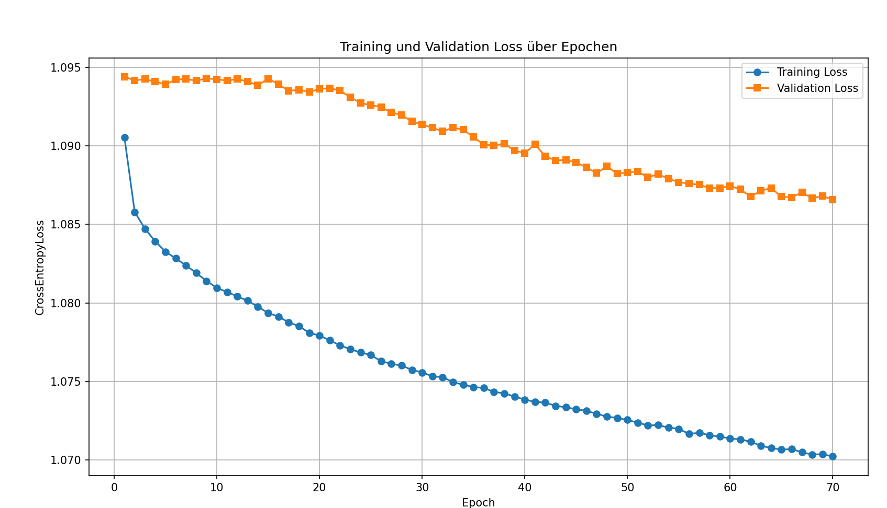

- Verzögerter Validierungs-Start: Die Validation Loss stagniert in den ersten ~15 Epochen bei ~1.094, während die Training Loss bereits deutlich fällt – das Modell lernt zunächst nur trainingsspezifische Muster
- Späte aber kontinuierliche Verbesserung: Ab Epoch 15 sinkt die Validation Loss stetig auf ~1.087 und zeigt damit durchgehende Verbesserung der Generalisierung über alle Epochen
- Beste Performance aller Modelle: Mit finaler Validation Loss von ~1.0866 (unter der baseline) und weiterhin sinkender Training Loss (~1.0702) zeigt dieses Modell die beste Balance zwischen Lernfortschritt und Generalisierung
- Vergrößern der Lernrate auf 0.001 von 0.00001 und das Verwenden von zwei Layern und einer hidden_size von 16 führt zu einem minimal besseren Ergebnis

*7.Versuch*

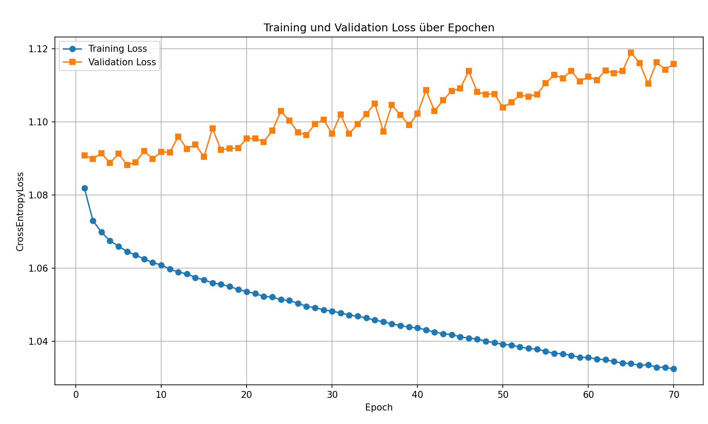

- Starkes Overfitting: Die Training Loss sinkt kontinuierlich auf ~1.033, während die Validation Loss sogar ansteigt – ein extremes Auswendiglernen der Trainingsdaten
- Keine Generalisierung: Die Validation Loss liegt durchgehend deutlich über der baseline (~1.09) und zeigt keine Verbesserung, das Modell lernt keine verallgemeinerbaren Muster
- Der Optimierungsalgorithmus Adam zeigt eine deutliche Verschlechterung zum bisher verwendeten SGD-Optimizer

#### Ausgewählter Versuch

Der Vergleich der Modellvarianten zeigt, dass die Konfiguration aus dem sechsten Versuch insgesamt die besten Ergebnisse erzielt, weshalb wir für das Modell Testing, mit diesem Modell fortfahren werden.
Das Modell mit nur zwei LSTM-Layern und einer hidden_size von 16 erzielte in den Versuchen insgesamt bessere Ergebnisse als tiefere Architekturen mit größeren hidden_sizes.
Die Experimente zeigen außerdem, dass eine kürzere Sequenzlänge von 6 Stunden deutlich bessere Ergebnisse liefert als längere Sequenzen wie 24 Stunden. 
Ein möglicher Grund dafür ist, dass kurzfristige Trendmuster im Bitcoin-Kurs meist nur über wenige Stunden hinweg stabil sind, während längere Zeitfenster verstärkt zufällige Schwankungen enthalten und dadurch das Modell mit Rauschen statt relevanten Signalen konfrontieren.

Trotz dieser Verbesserung liegt der Loss des Modells aus Versuch 6 nur geringfügig unter dem Wert eines zufälligen Klassifikators.
Im sechsten Versuch erreicht das Modell eine Accuracy von 0.397, was auf den ersten Blick solide erscheint, allerdings spiegelt die deutlich niedrigere F1-macro von 0.324 wider, dass die Klassen unausgewogen vorhergesagt werden. 
Der Recall-macro von 0.377 zeigt zwar, dass das Modell einen Teil der tatsächlichen Trendbewegungen korrekt erkennt, insgesamt liegt die Leistung aber nur knapp über dem Zufallsniveau und deutet auf begrenzte Generalisierungsfähigkeit hin.

### Baseline-Modell - Random Forest

Als Baseline-Modell wurde das Random-Forest-Modell ausgewählt. Wir wollen nun vergleichen, ob das LSTM-Modell besser funktioniert als das Random-Forest-Modell.

Funktionsweise des Random-Forest-Modells
1) Für jeden Baum wird zufällig eine Teilmenge der Trainingsdaten ausgewählt.
2) Bei jeder Aufteilung eines Knotens wählt der Baum eine zufällige Teilmenge von Merkmalen aus.
3) Jeder Baum wird so lange trainiert, bis keine weitere Verbesserung der Aufteilung mehr möglich ist.
4) Für die Klassifizierung wählt Random Forest die endgültige Klasse wie folgt aus: class=max(Stimmen der Bäume)

*Wichtig:* Das Random-Forest-Modell verwendet keine zeitliche Datenstruktur!
Mit diesem Baseline-Modell können wir also deutlich sehen, ob diese Aufgabe ohne zeitliche Komponente gelöst werden kann oder on für diesen Anwendungsfall das LSTM-Modell besser funktioniert.

#### Parameter für Baseline-Modell:

Für unser Random-Forest-Modell haben wir die Parameter ausgewählt, bei denen das Modell die höchste Genauigkeit erreicht.

| Parameter           | Bedeutung                                   |
|---------------------|---------------------------------------------|
| n_estimators=200    | Mehr Bäume —> stabileres Modell             |
| max_depth=None      | Das Modell kann komplexe Trennungen lernen. |
| min_samples_split=5 | Leichte Regulierung —> weniger Umschulung   |
| min_samples_leaf=2  | Reduziert Rauschen                          |

Als Ergebnis haben wir folgende Werte erhalten:

| Merkmal      | Random Forest | LSTM  |
|--------------| ------------- |-------|
| Accuracy     | 0.355         | 0.397 |
| F1-macro     | 0.351         | 0.324 |
| Recall-macro | 0.360         | 0.377 |

Wie aus der obigen Tabelle ersichtlich ist, weist das LSTM-Modell eine höhere Genauigkeit sowie einen höheren Recall-Macro auf. Das bedeutet, dass es einen etwas größeren Anteil der Objekte korrekt vorhergesagt hat als Random Forest und auch seltene Klassen besser erkennt. 
Allerdings ist der F1-Macro-Wert bei LSTM niedriger, was bedeutet, dass das Modell trotz seiner besseren Fähigkeit, Klassen zu finden, immer noch häufiger Fehler macht und sie mit anderen verwechselt.

Obwohl der Unterschied zwischen Random Forest und LSTM relativ gering ist, hat er dennoch eine besondere Bedeutung. Random Forest berücksichtigt keine zeitliche Struktur, während LSTM speziell für die Modellierung von Sequenzen verwendet wird. Die etwas bessere Genauigkeit und das höhere Recall-Macro der LSTM-Modells zeigen, dass die zeitlichen Abhängigkeiten im Datensatz zwar schwach, aber insgesamt vorhanden sind.

### Baseline-Modell - Shannon-Entropie

Die Shannon-Entropie misst die Unsicherheit einer Klassenverteilung und gibt an, wie schwer es ist, die richtige Klasse zufällig zu erraten. 
Je höher die Entropie, desto ausgewogener sind die Klassen und desto weniger Information enthält die Verteilung über die erwartete Klasse. 
In diesem Projekt wird die Entropie als Baseline verwendet, um den Loss eines zufälligen Klassifikators unter Berücksichtigung der echten Klassenhäufigkeiten abzuschätzen. 
Dadurch lässt sich bewerten, ob das trainierte Modell tatsächlich Muster gelernt hat oder nur auf dem zufälligen Erwartungsniveau liegt.

Die Berechnung ergab eine Shannon-Entropie ≈ 1.09

- ModelLoss < ShannonEntropy → Modell lernt Informationen
- ModelLoss ≈ ShannonEntropy → Modell ist random

Bei unserem besten Versuch beträgt der Validation Loss, der durch CrossEntropy-Loss ermittelt wurde, 1.0866. 
Der Loss-Wert ist also nur minimal besser als das zufällige Loss. 

---

## Step 8 - Model Testing

**Script**

- [scripts/08_model_testing/BTCSequenceDataset.py](scripts/08_model_testing/lstm_testing.py)
- [scripts/08_model_testing/LSTM_Pytorch.py](scripts/08_model_testing/random_forest_testing.py)

### Testing LSTM-Modell

Ziel des Testings ist es, die tatsächliche Generalisierungsfähigkeit des Modells auf bisher ungesehenen Daten zu überprüfen und zu bewerten, ob das Modell über das zufällige Erwartungsniveau hinaus sinnvolle Muster aus der Bitcoin-Trendhistorie gelernt hat.

Während des Trainings wird nach jeder Epoche der Validierungs-Loss berechnet und mit dem bisher besten Wert verglichen.
Sobald das Modell eine bessere Validierungsleistung erreicht, werden die aktuellen Modellgewichte gespeichert.
Auf diese Weise wird immer das Modell gesichert, das am besten generalisiert und nicht das Modell aus der letzten Trainingsepoche.
Beim Testing wird genau dieses „Best-Model“ geladen, um eine faire und objektive Bewertung auf den zuvor ungesehenen Testdaten zu ermöglichen.
Im Testing wird ein neues Modell mit identischer Architektur erzeugt und die während des Trainings ermittelten besten Modellgewichte geladen und für die Vorhersage auf den Testdaten verwendet.

**Ergebnisse**

| Merkmal      | Test   |
|--------------|--------|
| Accuracy     | 0.3952 |
| F1-macro     | 0.2863 |
| Recall-macro | 0.3651 |
 | Loss         | 1.0907 |

Das getestete LSTM-Modell erreicht auf den zuvor ungesehenen Testdaten eine Accuracy von 0.3952 sowie einen Recall-macro von 0.3651 und liegt damit nur leicht über dem zufälligen Erwartungsniveau.
Die Werte zeigen, dass das Modell nur eine eingeschränkte Generalisierungsfähigkeit besitzt.
Der Loss-Wert des Modells liegt ungefähr bei dem erwarteten Basiswert eines zufälligen Klassifikators (Shannon-Entropie ≈ 1.09).
Daraus lässt sich schließen, dass das Modell den Bitcoin-Trend in der nächsten Stunde nicht zuverlässiger vorhersagen kann als eine zufällige Klassenzuordnung auf Basis der Klassenverteilung.

Die Konfusionsmatrix zeigt, dass das LSTM-Modell nahezu alle Eingaben als „NEUTRAL“ klassifiziert, unabhängig vom tatsächlichen Trendverlauf.
Dadurch werden „DOWN“ und „UP“ nur sehr selten korrekt erkannt, während „NEUTRAL“ in vielen Fällen richtig vorhergesagt wird.
Dieses Ergebnis deutet darauf hin, dass das Modell nicht die relevanten zeitlichen Muster für Trendwechsel gelernt hat, sondern sich stark auf die dominante Klassenverteilung im Datensatz stützt.

### Testing Random Forest

Zum Vergleich des LSTM-Modells wird auch das Random Forest Modell getestet.

| Merkmal      | Random Forest | LSTM    |
|--------------|---------------|---------|
| Accuracy     | 0.326         | 0.3952  |
| F1-macro     | 0.273         | 0.2863  |
| Recall-macro | 0.344         | 0.3651  |

Der Vergleich zeigt, dass das LSTM-Modell in allen Metriken leicht bessere Werte erzielt als der Random Forest und damit besser in der Lage ist, Muster in den Zeitreihendaten zu erkennen.
Die Unterschiede zwischen beiden Modellen sind jedoch nur gering, was darauf hindeutet, dass beide Ansätze Schwierigkeiten haben, den Bitcoin-Trend zuverlässig vorherzusagen.
Insgesamt liegen beide Modelle nur knapp über einer zufälligen Vorhersage, sodass die aktuelle Feature-Basis und Modellierung die zugrunde liegende Marktstruktur nicht ausreichend erfassen.

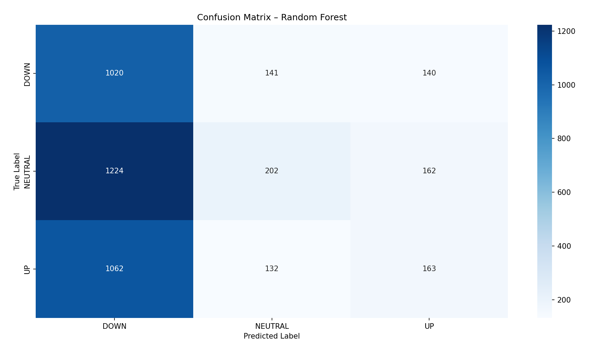

Die Confusion Matrix zeigt, dass der Random Forest nahezu alle Klassen als „DOWN“ vorhersagt. 
Während tatsächliche „DOWN“-Trends noch relativ häufig korrekt erkannt werden, werden die Klassen „NEUTRAL“ und „UP“ fast vollständig fälschlich als „DOWN“ klassifiziert.

## Step 9 - Deployment

### Backtesting traidng algorithms

**Script**

[scripts/09_model_deployment/backtesting.py](scripts/09_model_deployment/backtesting.py)

Das Backtesting wurde durchgeführt, indem das trainierte LSTM-Modell auf historische Testdaten angewendet wurde. Die Modellvorhersagen wurden in Handelssignale umgewandelt, und eine regelbasierte Handelsstrategie wurde über einen bestimmten Zeitraum simuliert. Das Portfolio-Eigenkapital wurde in jedem Zeitschritt verfolgt, um die historische Performance zu bewerten.

### Entry and Exit Points

*Entry Point*

Bedingungen:
- predicted class = UP
- prob_up - prob_down >= 0.5
- entweder keine Position vorhanden oder Position bereits auf dem Markt

Entry Preis: Schlusskurs der aktuellen Stunde

Entry Size: 
- erster Einstieg = 10% der vorhandenen buying power
- nachfolgende Einstiege = 5% der vorhandenen buying power

*Exit Point*

Bedingungen:
- predicted class = DOWN
- prob_down - prob_up >= 0.5
- Position vorhanden und auf dem Markt

Exit Preis: Schlusskurs der aktuellen Stunde

Exit Volumen: 100% der Position

### Trading Algorithm

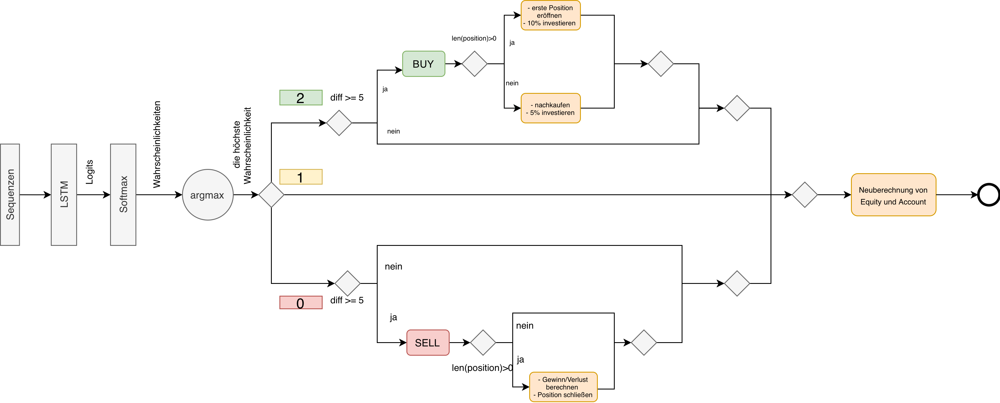

Der Handelsalgorithmus basiert auf den probabilistischen Vorhersagen eines trainierten LSTM-Modells. Für jeden Zeitschritt werden historische Marktdaten in Sequenzen umgewandelt und dem Modell zugeführt, welches Wahrscheinlichkeiten für drei Klassen ausgibt: DOWN, NEUTRAL und UP. Das Handelssignal wird durch die Klasse mit der höchsten Wahrscheinlichkeit bestimmt. Zusätzlich wird ein Konfidenzfilter angewendet, der nur Signale berücksichtigt, bei denen die absolute Differenz zwischen den Wahrscheinlichkeiten für UP und DOWN mindestens 5 % beträgt.
Ein Order* wird nur dann ausgelöst, wenn ein ausreichendes UP- oder DOWN-Signal vorliegt. Bei einem bestätigten UP-Signal wird ein BUY-Order platziert. Existiert noch keine offene Position**, wird eine erste Long-Position eröffnet, indem 10 % des aktuell verfügbaren Kontoguthaben (Account***) investiert werden. Ist bereits eine Position geöffnet, wird bei weiteren UP-Signalen ein Nachkauf-Order ausgeführt, bei dem zusätzlich 5 % des verbleibenden freien Kapitals investiert werden. Das investierte Kapital wird dabei vom Account abgezogen und in eine offene Position überführt.
Bei einem bestätigten DOWN-Signal wird ein Verkaufs-Order (SELL) ausgelöst. Falls eine Position besteht, wird diese vollständig geschlossen, indem die gesamte gehaltene Asset-Menge zum aktuellen Schlusskurs verkauft wird. Der Verkaufserlös wird dem Account wieder gutgeschrieben, und die Position wird aus dem Portfolio entfernt. Existiert keine offene Position, wird kein Order ausgeführt.
Nach jedem Zeitschritt wird der Portfoliowert neu berechnet. Die Equity ergibt sich aus der Summe des verfügbaren Kontoguthabens und dem aktuellen Marktwert der offenen Position. Diese fortlaufende Neubewertung ermöglicht die Konstruktion einer Equity-Kurve, welche die historische Performance der Handelsstrategie im Backtesting widerspiegelt.

*Order - eine konkrete Handelsanweisung, die aufgrund eines Modellsignals ausgelöst wird.
In dieser Strategie entspricht ein Order einem Kauf (BUY) oder einem Verkauf (SELL), der zum Schlusskurs des aktuellen Zeitpunkts ausgeführt wird. 

**Position - der aktuell gehaltene Marktanteil des Assets.
Umfasst die gehaltene Asset-Menge (Shares) sowie das insgesamt investierte Kapital. Eine Position entsteht durch einen BUY-Order, kann durch weitere BUY-Orders vergrößert werden und wird durch einen SELL-Order vollständig geschlossen.

***Account - das verfügbare liquide Kapital der Strategie.
Er reduziert sich bei BUY-Orders um den investierten Betrag und erhöht sich bei SELL-Orders um den Verkaufserlös. Der Account enthält ausschließlich freie Mittel und ist ein Bestandteil der Equity-Berechnung.

### Overall Performance

**Ergebnisse des Backtestings**

Backtesting-Zeitraum: 08.05.2025 – 31.10.2025 (Stundenauflösung)

Zentrale Kennzahlen:

- Startkapital: 100 000,00
- Finales Kapital: 110 531,63
- Absoluter Gewinn: +10 531,63
- Relative Rendite: +10,53 %
- Anzahl Trades-Signalen: 416
- Anzahl BUY-Orders: 253
- Anzahl SELL-Orders: 15

Die Strategie erzielt im betrachteten Zeitraum eine stetig positive Gesamtperformance bei hoher Handelsaktivität.

*1) Entwicklung der Equity-Kurve im Backtesting*

Der Graph zeigt, wie sich der Wert des Portfolios im Laufe der Zeit verändert, und bewertet die Rentabilität und Nachhaltigkeit der Handelsstrategie auf der Grundlage der Modellprognosen.

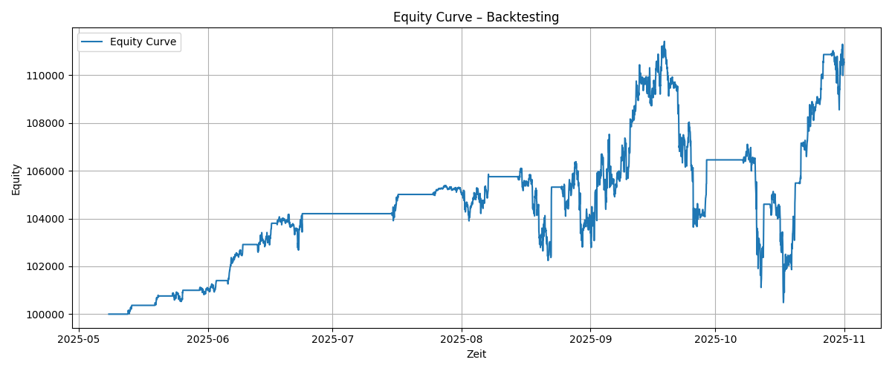

Die Equity-Kurve zeigt einen klaren langfristigen Aufwärtstrend über den gesamten Backtesting-Zeitraum hinweg, mit zeitweiligen Rückgängen. 
Der stufenweise Verlauf der Kurve spiegelt die grundlegende Handelslogik wider, bei der Positionen schrittweise eröffnet und vollständig geschlossen werden. 
Trotz Phasen erhöhter Marktvolatilität und vorübergehender Rückgänge bleibt der Kapitalverlust begrenzt, und es kommt zu keinen abrupten oder strukturellen Kapitalverlusten. Insgesamt deutet der Verlauf der Kapitalkurve darauf hin, dass die auf LSTM basierende Handelsstrategie in der Lage ist, stabil positive Renditen zu erzielen.

*2) Zeitliche Verteilung von BUY- und SELL-Signalen*

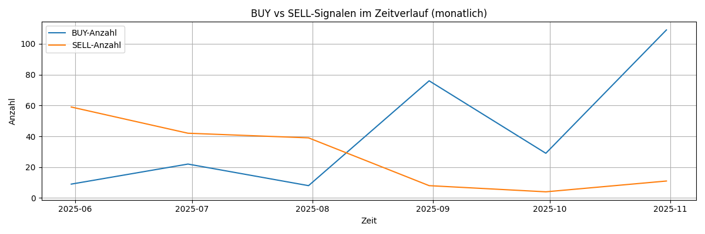

Das Diagramm zeigt, dass im Zeitverlauf deutlich mehr BUY- als SELL-Signale generiert werden, insbesondere in späteren Monaten. Dies deutet darauf hin, dass das LSTM-Modell überwiegend positive Markterwartungen erkennt und die Strategie gezielt auf Aufwärtsbewegungen ausgerichtet ist.

*3) BTC-Preisverlauf mit generierten BUY- und SELL-Signalen*

Für die Darstellung des Preisverlaufs mit BUY- und SELL-Signalen wird nicht der gesamte Backtesting-Zeitraum, sondern ein repräsentatives Zeitfenster ausgewählt.
Dazu wird ein gleitendes Zeitfenster (z. B. 5 Tage) verwendet, innerhalb dessen die Anzahl der Handelsaktionen maximiert wird.
Konkret wird das Zeitfenster gewählt, in dem die höchste Dichte an BUY- und SELL-Signalen auftritt. Dadurch wird sichergestellt, dass der dargestellte Ausschnitt ausreichend viele Handelsentscheidungen enthält und somit eine aussagekräftige visuelle Analyse ermöglicht.

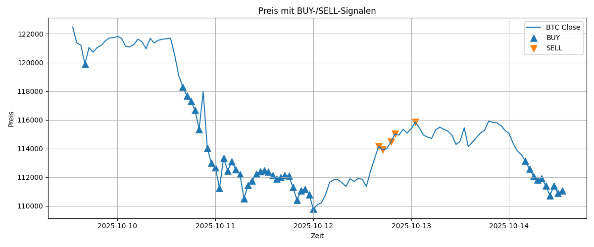

Der Graph zeigt, dass BUY-Signale überwiegend in Phasen fallender oder konsolidierender Preise auftreten, während SELL-Signale vor allem nach kurzfristigen Aufwärtsbewegungen gesetzt werden. 
Dabei ist zu sehen, dass das Modell nicht immer richtig liegt und auch Fehlsignale generiert. Beispielsweise fällt der Preis zwischen Anfang und Mitte November kontinuierlich, aber das Modell sendet BUY-Signale.

*4) Wöchentliche Handelsaktivität der Strategie*

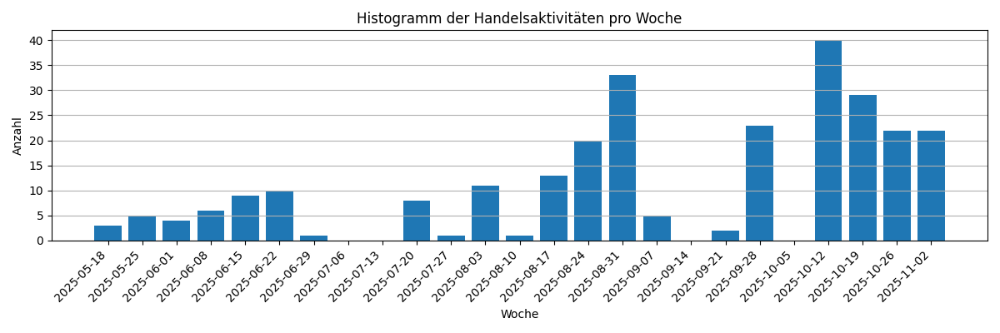

Das Histogramm zeigt eine stark schwankende Anzahl an Trades pro Woche. In einzelnen Wochen tritt eine hohe Handelsaktivität auf, während in anderen Zeiträumen nur wenige oder gar keine Trades ausgeführt werden.
Die ungleichmäßige Verteilung der Trades deutet darauf hin, dass die Strategie nicht konstant handelt, sondern ihre Aktivität an die Marktbedingungen anpasst und vor allem in Phasen mit klaren Signalen verstärkt aktiv wird.

*5) Gesamtverteilung der BUY- und SELL-Aktionen*

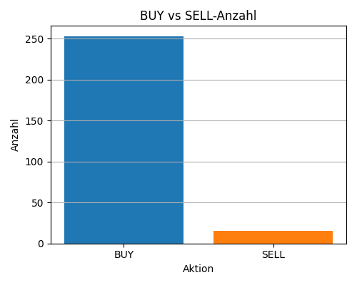

Der Graph zeigt, dass die Anzahl der BUY-Aktionen deutlich höher ist als die Anzahl der SELL-Aktionen. Dies weist darauf hin, dass die Strategie häufiger Positionen eröffnet bzw. aufstockt, während Positionsschließungen seltener erfolgen.
Ein SELL wird nur dann ausgeführt, wenn tatsächlich eine offene Position existiert. DOWN-Signale ohne bestehende Position bleiben daher ohne Handelsaktion, was die höhere Anzahl an BUY-Aktionen im Vergleich zu SELL-Aktionen erklärt.

*6) Vergleich von Bitcoin-Preis und Portfolioentwicklung*

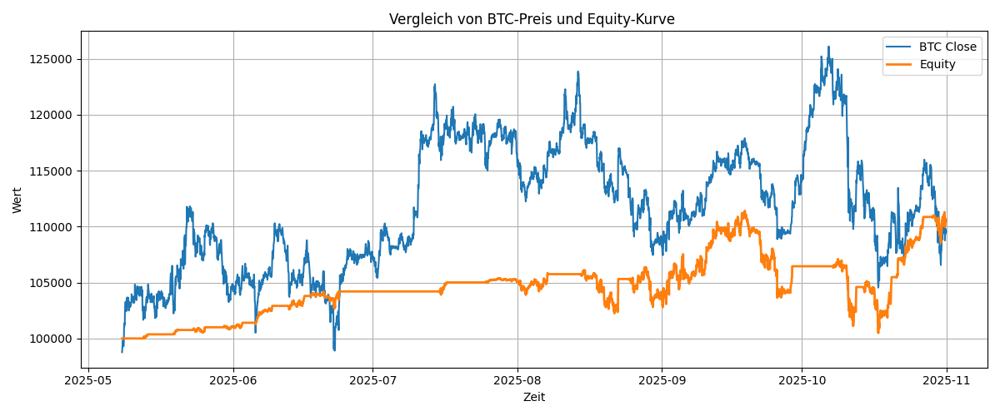

Der Bitcoin-Preis zeigt im Zeitverlauf starke Schwankungen mit ausgeprägten Auf- und Abwärtsbewegungen. Die Equity-Kurve folgt dem allgemeinen Markttrend, verläuft jedoch deutlich glatter und mit geringerer Volatilität. 
In Phasen steigender Preise wächst auch das Portfolio, während Rückgänge des Marktes zu temporären, aber begrenzten Rücksetzern der Equity führen. Beide Kurven entwickeln sich grundsätzlich in die gleiche Richtung, jedoch mit unterschiedlicher Dynamik. 
Während der Markt stark schwankt, wächst das Kapital kontrollierter. 

## Paper trading

**Script**

[scripts/09_model_deployment/paper_trading.py](scripts/09_model_deployment/paper_trading.py)

### Aufsetzen von Paper trading

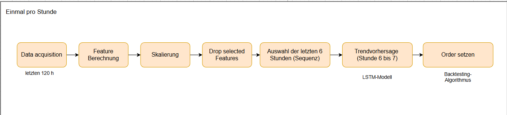

Data acquisition:
- Nutzung der yfinance API
- Verwendung der letzten 120 Stunden, um ausreichend Daten zu haben, um Features wie RSI und EMA zu berechnen

Feature Berechnung, Skalierung, Drop selected features:
- Nutzung der bereits fertigen Methode zur Berechnung der Features -> Pre-Split Preparation
- Nutzung des bereits gefitteten StandardScalers für die Skalierung -> Post-Split Preparation
- Löschung der Features, die bei der feature selection als redundant festgestellt wurden

Nutzung des LSTM-Modells:
- Die letzten sechs Stunden, die von der API zurückgegeben wurden, werden als Sequenz in das LSTM-Modell gegeben 
- Sechs Stunden entsprechen der zuvor verwendeten Sequenzlänge 
- Die gespeicherten Modellgewichte werden für die Vorhersage verwendet
- Der vorhergesagte Trend bezieht sich darauf, wie sich der Bitcoin Close Preis von Stunde 6 bis zur Stunde 7 entwickeln wird

Das Setzen eines Orders folgt der gleichen Logik wie der Backtesting Algorithmus.

### Paper trading performance

*6) Equity Kurve Verlauf*

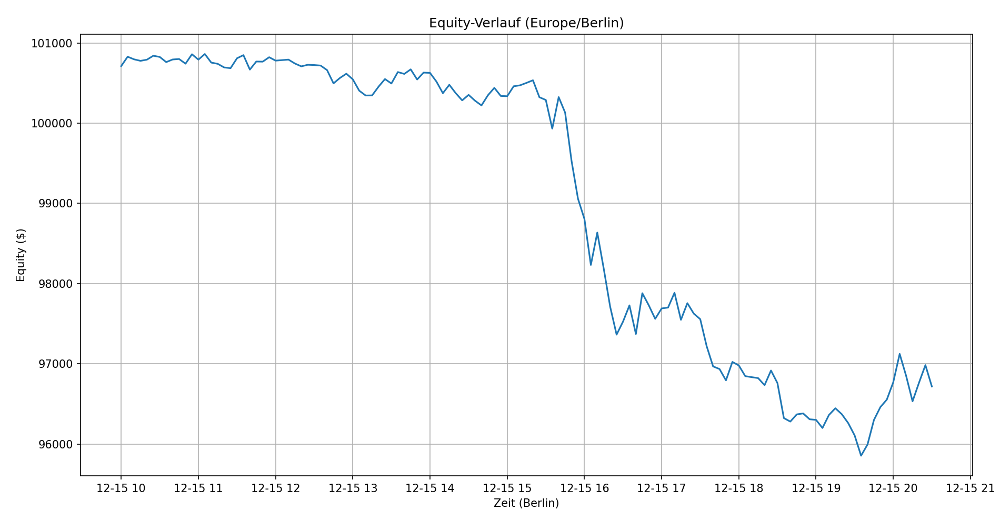

- Betrachteter Zeitraum: 15.12.2025 10 Uhr bis 20 Uhr
- zeigt insgesamt einen sinkenden Trend
- Start Portfolio: $100,710.87
- End Portfolio: $96,876.92 
- Veränderung: $-3,833.95 (-3.81%)
- getätigte Trades: 11
- jede Stunde wurde ein Order gesetzt
- es gab ausschließlich Buy Signale 

*6) Close Bitcoin price vs trades*

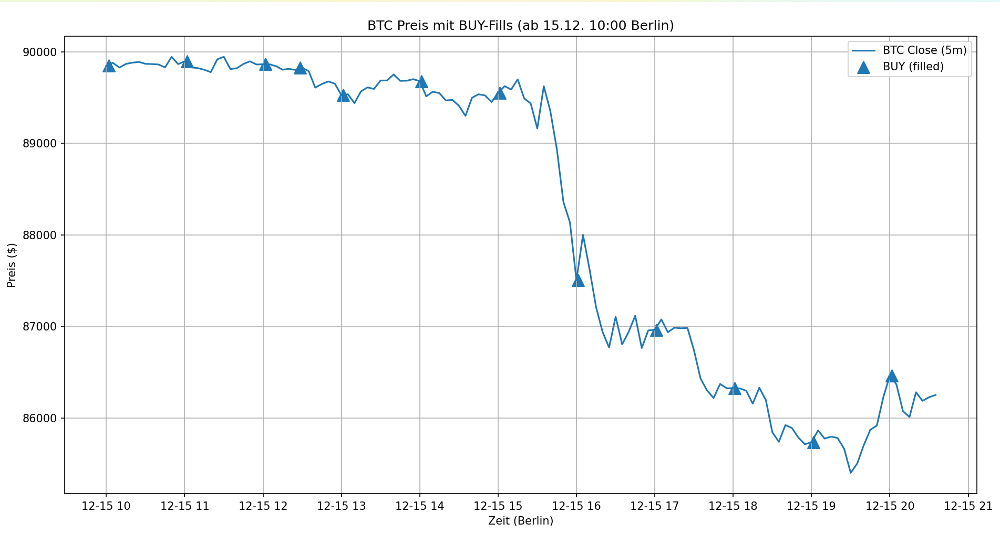

- Buy-Signale werden gesendet, obwohl der Bitcoin Preis in der nächsten Stunde sinkt
- Buy-Signale sollten eigentlich vor einem Bitcoin Preis Anstieg gesendet werden
- Down-Phasen werden von dem Modell nicht erkannt und darum werden keine Sell-Signale gesendet

#### Stündliche Performance

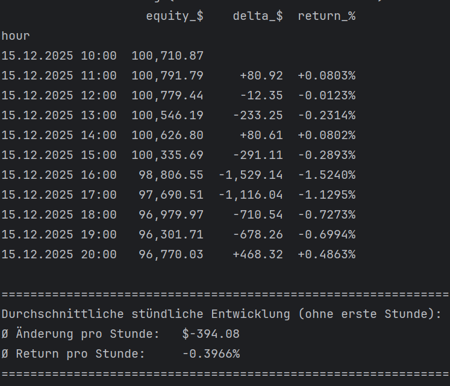

- Stündlicher Verlust ist zu verzeichnen 

### Paper trading vs Backtesting

