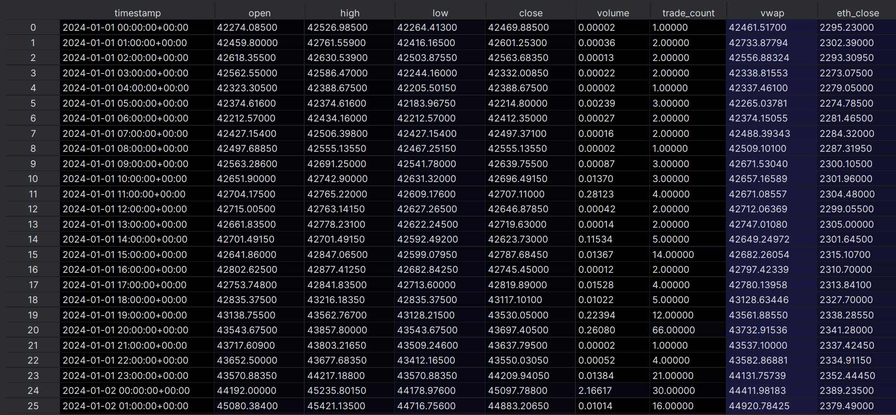
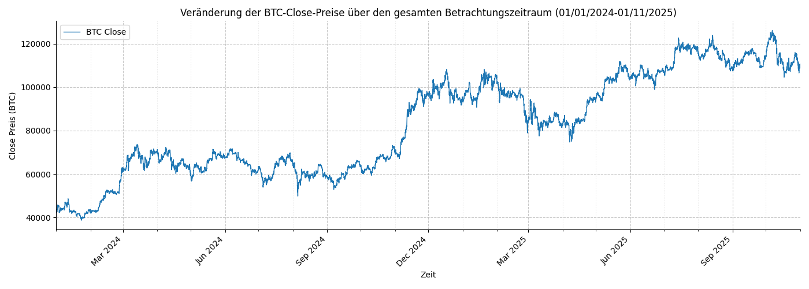
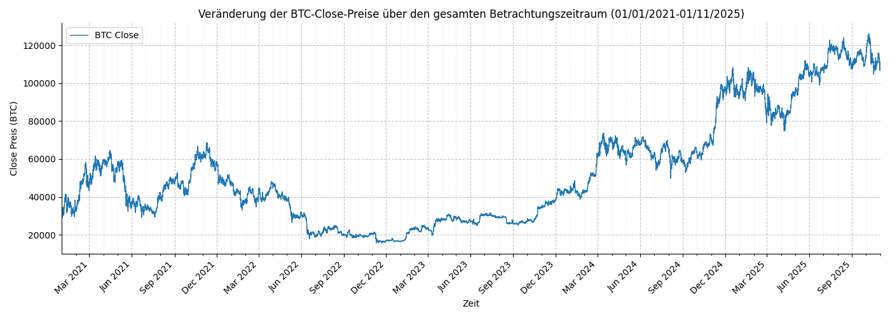
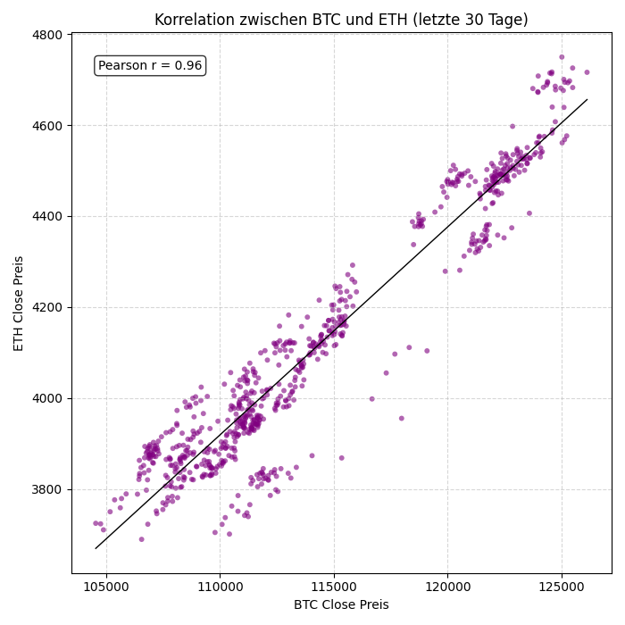

# Team 09 - Projekt Trading

### Problem Definiton:

**Target**

Ziel dieses Projekts ist die Vorhersage der Trendrichtung des Bitcoin-Preises in der nächsten Stunde.
Für die Modellierung werden stündliche Bitcoin-Daten im Zeitraum 01.01.2024 bis 01.11.2025 als Trainings- und Validierungsgrundlage verwendet.
Auf Basis dieser historischen Stundenwerte soll das Modell lernen, für jeden Zeitpunkt vorherzusagen, ob der Bitcoinpreis in der darauffolgenden Stunde steigt, fällt oder innerhalb eines definierten Schwellenwerts neutral bleibt.
Die Trendrichtung wird dabei anhand des prozentualen Preisreturns zwischen dem aktuellen und dem nachfolgenden Schlusskurs berechnet.
Bewegungen innerhalb einer kleinen Toleranzzone werden als neutral klassifiziert, um Marktrauschen zu reduzieren und stabile Labels zu erzeugen.

**Input features**

Das Modell verarbeitet pro Stunde eine Reihe Features, die Preisstruktur, Trend, Momentum und Cross-Asset-Information abbilden:
- Preis- und Volumenmerkmale: open, high, low, close, volume, VWAP (volumengewichteter Durchschnittspreis)
- Momentum-Merkmale: return_1h und return_6h --> prozentuale Preisveränderung über 1 bzw. 6 Stunden
- Trendindikatoren: EMA_6 und EMA_24 --> normalisierte exponentielle gleitende Durchschnitte
- RSI (Trendstärke-Indikator aus Preisänderungen)
- Cross-Asset-Features anhand von Ethereum: ETH_Close, ETH_return_1h, ETH_return_6h, ETH/BTC Ratio (relative Stärke zwischen ETH und BTC)

### Procedure Overview:

- Datensammlung: Erhebung von stündlichen Bitcoin- und Ethereum-Daten im Zeitraum 01.01.2024 bis 01.11.2025
- Feature Engineering: Berechnung aller oben beschriebenen preis-, volumen-, trend- und momentumbezogenen Merkmale sowie Cross-Asset-Features.
- Labelgenerierung: Berechnung des 1-Stunden-Returns und Klassifikation der Trendrichtung in Up / Down / Neutral anhand einer Toleranzschwelle.
- Modelltraining: Training eines LSTM-Netzwerks, das aus 48-stündigen Sequenzen die Trendklasse der nächsten Stunde vorhersagt.

Zielsetzung: 
Die Analyse soll Muster in Preis-, Volumen- und Cross-Asset-Beziehungen identifizieren, die kurzfristige Trendbewegungen im Bitcoin-Markt vorhersagen.
Durch die Modellierung der Trendrichtung (Up/Down/Neutral) auf Basis historischer Daten sollen Entscheidungsgrundlagen geschaffen werden, um günstige Kauf- und Verkaufszeitpunkte zu erkennen und so potenziell profitablere Handelsentscheidungen zu ermöglichen.

In einem hypothetischen Trading-Kontext könnten diese Signale wie 
folgt interpretiert werden:
- Up → Kaufsignal
- Down → Verkaufssignal  
- Neutral → Keine Aktion (Position halten)

## Step 1 - Data Acquisition

Es werden Rohmarktdaten für Bitcoin und Ethereum extrahiert. Da Kryptowährungen rund um die Uhr gehandelt werden, ist keine Filterung nach Öffnungs- oder Schließzeiten erforderlich.

**Script**

[scripts/01_data_acquisition/01_data_acquisition.py](scripts/01_data_acquisition/01_data_acquisition.py)

Lädt stündliche, Kursbalken (OHLCV) für Bitcoin und Ethereum im Zeitraum vom 01.01.2024 bis zum 01.11.2025 und speichert die Daten als Parquet-Dateien.
Im nächsten Schritt werden die Bitcoin-Daten mit dem Ethereum-Schlusskurs über den gemeinsamen Zeitstempel gemergt, sodass der ETH-Close-Wert als zusätzliches Feature zur Verfügung steht.

Bar data example:

 

---

## Step 2 - Data Understanding

Analyse historischer BTC-Preisdaten, um die Struktur, Eigenschaften und das Verhalten der Zeitreihe zu verstehen.
Ziel ist es, wichtige statistische Abhängigkeiten, sich wiederholende Muster und Besonderheiten zu identifizieren, die die Auswahl der Merkmale und die Architektur des Modells beeinflussen.

**Data Colums**

| Column      | Description                                                                            |
|-------------|----------------------------------------------------------------------------------------|
| timestamp   | Der genaue Zeitpunkt (UTC), zu dem die stündliche Kerze geschlossen wurde - Zeitindex. |
| open        | Der BTC-Preis zu Beginn des Stundenintervalls.                                         |
| high        | Der höchste BTC-Preis, der während dieser Stunde erreicht wurde.                       |
| low         | Der niedrigste BTC-Preis, der während dieser Stunde erreicht wurde.                    |
| close       | Der BTC-Preis am Ende des Stundenintervalls (Zielvariable).                            |
| volume      | Das gehandelte BTC-Volumen während der Stunde - Marktaktivität.                        |
| trade_count | Anzahl der ausgeführten Trades innerhalb einer Stunde.                                 |
| vwap        | Volumengewichteter Durchschnittspreis für die Stunde.                                  |
| eth_close   | Der stündliche Schlusskurs von Ethereum (ETH).                                         |

**Script**

[scripts/02_data_understanding/plotter.py](scripts/02_data_understanding/plotter.py)

**Plots**

*1) Entwicklung des BTC-Schlusskurses über den gesamten Zeitraum 2024–2025 vs 2021-2025*

Dieses Diagramm zeigt die langfristige Entwicklung des Schlusskurses von BTC über den gesamten Beobachtungszeitraum. Es ermöglicht die Darstellung der Gesamtstruktur einer Zeitreihe.

 

Ursprünglich haben wir einen Chart mit den Schlusskursen von BTC nur für den Zeitraum 2024–2025 erstellt.
In diesem Zeitraum war jedoch fast ausschließlich ein anhaltender Aufwärtstrend ohne nennenswerte Korrekturen zu beobachten.
Damit das Modell nicht nur auf Wachstumsphasen des Marktes trainiert werden konnte, haben wir den Zeitrahmen auf 2021–2025 erweitert.

 

Dieser Bereich umfasst starke Preisrückgänge, beispielsweise den starken Einbruch, der im Dezember 2021 einsetzte, wodurch das Modell verschiedene Marktbedingungen berücksichtigen kann.

*4) Veränderung der BTC/ETH-Close-Preise über den letzten Tag*

*5) Korrelation zwischen BTC und ETH (letzte 30 Tage)*

Dieses Diagramm ist ein Streudiagramm, in dem jeder Punkt ein Wertepaar aus BTC_close und ETH_close zur gleichen Uhrzeit darstellt.
Wir haben dieses Diagramm erstellt, um endgültig zu bestätigen, dass ETH ein nützliches zusätzliches Merkmal für das Modell ist.

Auf dem Diagramm ist deutlich zu erkennen, dass die Datenpunkte entlang einer aufsteigenden Linie konzentriert sind.
Dies deutet auf eine sehr starke positive lineare Abhängigkeit zwischen BTC und ETH hin.
Der berechnete Pearson-Korrelationskoeffizient r = 0,96 bestätigt diese Abhängigkeit zusätzlich.

 

