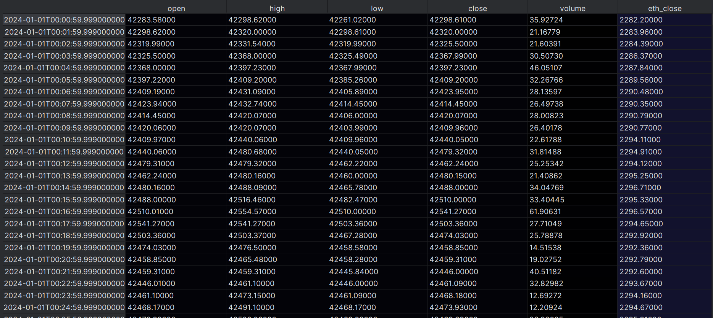
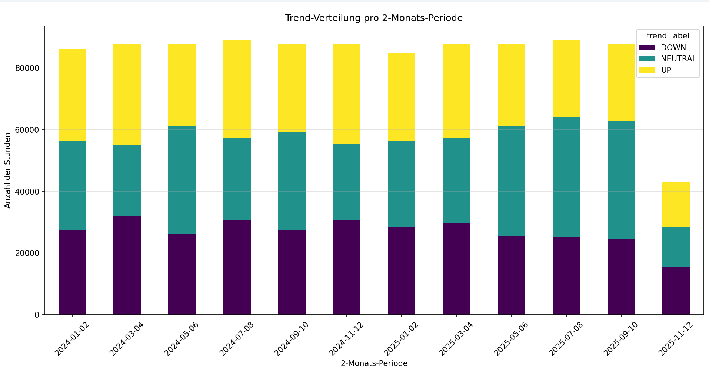
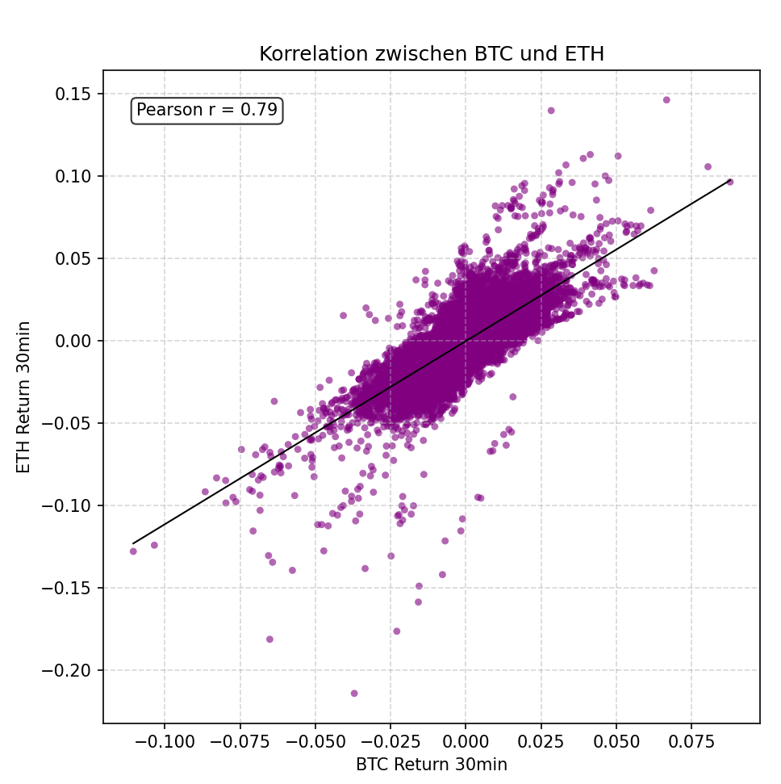
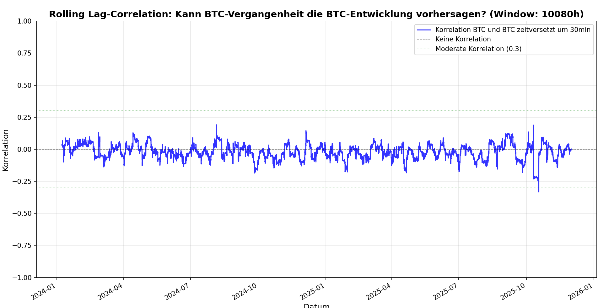
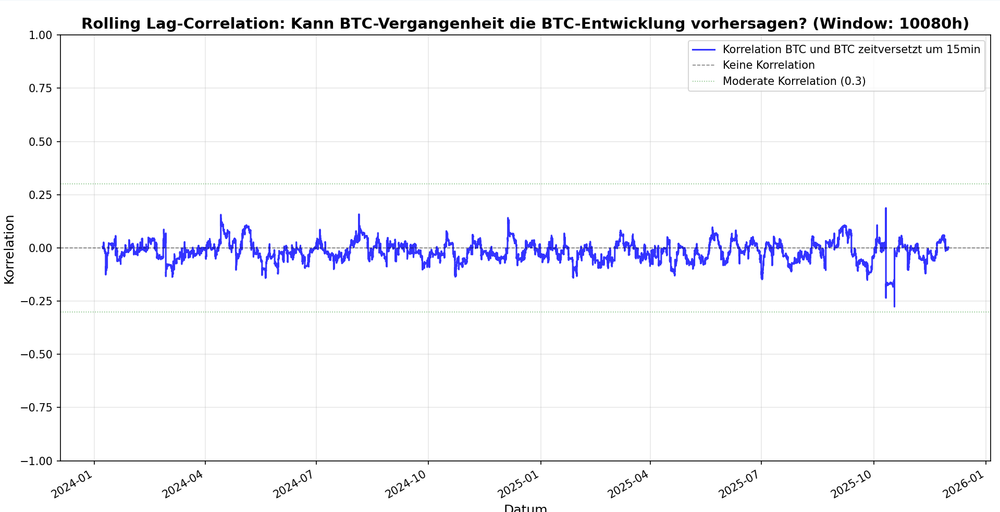
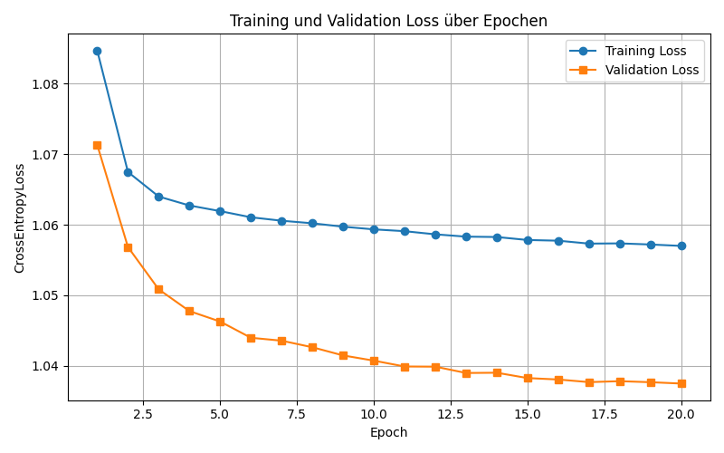

# Team 09 - Projekt Trading

## 📚 Table of Contents

- [Problem Definiton](#problem-definiton)
- [Step 1 - Data Acquisition](#step-1---data-acquisition)
- [Step 2 - Data Understanding](#step-2---data-Understanding)
- [Step 3 - Data Preparation (Pre-Split)](#step-3---data-preparation-pre-split)
- [Step 4 - Split Data](#step-4---split-data)
- [Step 5 - Post-Split Preparation](#step-5---post-split-preparation)
- [Step 6 - Feature Selection](#step-6---feature-selection)
- [Step 7 - Model Training](#step-7---model-training)
- [Step 8 - Model Testing](#step-8---model-testing)
- [Step 9 - Model Deployment](#step-9---deployment)
- [Fazit und Next Steps](#fazit-und-next-steps)

--- 

### Problem Definiton:

**Target**

In diesem zweiten Experiment wird die Richtung der kurzfristigen Bitcoin-Preisentwicklung vorhergesagt. Ziel ist es, zu bestimmen, ob der Bitcoin-Preis innerhalb der nächsten 60 Minuten steigt oder fällt.
Im Gegensatz zum ersten Experiment, das auf stündlichen Daten basierte, werden in diesem Experiment minütliche Preisdaten im Zeitraum vom 01.01.2024 bis zum 30.11.2025 als Trainings- und Validierungsdaten verwendet. Durch die höhere zeitliche Auflösung soll eine feinere Erfassung kurzfristiger Marktbewegungen ermöglicht werden.
Während im ersten Experiment drei Klassen (steigend, fallend, neutral) betrachtet wurden, wird in diesem Experiment bewusst auf die Vorhersage eines neutralen Trends verzichtet. Stattdessen wird das Problem als binäre Klassifikationsaufgabe formuliert, um die Modellkomplexität zu reduzieren und die Trennschärfe zwischen steigenden und fallenden Marktbewegungen zu erhöhen.
Die Trendrichtung wird anhand des prozentualen Preisreturns zwischen dem aktuellen Zeitpunkt t und dem Schlusskurs nach 60 Minuten (t + 60) bestimmt. Ein positiver Return wird als steigender Trend, ein negativer Return als fallender Trend interpretiert.

Dieses Experiment basiert auf:
[Erstes Experiment](../exp_1_1/Exp_1_1.md)

**Input features**

Das Modell verarbeitet minütlich aufgelöste Zeitreihendaten, die verschiedene Aspekte der kurzfristigen Marktdynamik abbilden. Die verwendeten Features lassen sich in Preis- und Volumenmerkmale, Momentum- und Trendindikatoren sowie Cross-Asset-Informationen unterteilen.
Da nun minütliche und nicht stündliche Daten verwendet werden, werden die Zeithorizonte über denen die Features berechnet werden angepasst.

- Preis- und Volumenmerkmale: open, high, low, close und volume jeweils auf Minutenbasis.
- Momentum-Merkmale: return_5min, return_30min, return_60min --> prozentuale Preisveränderung über 5, 30 bzw. 60 Minuten
- Trendindikatoren: EMA_15 und EMA_60 --> normalisierte exponentielle gleitende Durchschnitte
- RSI (Trendstärke-Indikator aus Preisänderungen) --> berechnet über die letzten 14 Perioden
- ATR (Maß für die Volatilität des Marktes) --> berechent über die letzten 14 Perioden
- Cross-Asset-Features anhand von Ethereum: ETH_Close, ETH_return_5min, ETH_return_30min, ETH_return_60min, ETH/BTC Ratio (relative Stärke zwischen ETH und BTC)

## Step 1 - Data Acquisition

Im Gegensatz zum ersten Experiment wird in diesem Experiment die Binance-API anstelle der Alpaca-API verwendet, da bei der Nutzung von Alpaca auf Minutenbasis wiederholt unvollständige Zeitreihen mit fehlenden Minuten festgestellt wurden.

**Script**

[scripts/01_data_acquisition/01_data_acquisition.py](scripts/01_data_acquisition/data_acquisition.py)

Bar data example:

 

---

## Step 2 - Data Understanding

---

## Step 3 - Data Preparation (Pre-Split)

**Script**

- [scripts/03_pre_split_prep/features.py](scripts/03_pre_split_prep/features.py)
- [scripts/03_pre_split_prep/targets.py](scripts/03_pre_split_prep/targets.py)
- [scripts/03_pre_split_prep/main.py](scripts/03_pre_split_prep/main.py)
- [scripts/03_pre_split_prep/plot_features.py](scripts/03_pre_split_prep/plot_features.py)

### Features Berechnung

Da in diesem Experiment minütliche Kursdaten verwendet werden, wurde die Feature-Berechnung entsprechend auf kürzere Zeithorizonte angepasst. 
Ziel dieser Umstellung ist es, kurzfristige Marktbewegungen und Dynamiken präziser abzubilden, die in stündlichen Aggregationen teilweise verloren gehen.

Die neu gewählten Feature-Fenster sind:

- Returns: 5, 15, 30, 60 und 90 Minuten -> wird für BTC und ETH berechnet
- Exponential Moving Averages (EMA): 20 und 90 Minuten
- Momentum & Volatilität: RSI und ATR mit einem Fenster von 14 Minuten

Durch diese Feature-Auswahl werden sowohl sehr kurzfristige Preisänderungen (z. B. Momentum und Volatilität) als auch kurz- bis mittelfristige Trends erfasst. 
Dies ist insbesondere für die Vorhersage der Bitcoin-Trendrichtung auf einem kurzfristigen Prognosehorizont vorteilhaft, da das Modell schneller auf neue Marktinformationen reagieren kann und feinere zeitliche Muster lernt.

### Target Berechnung

Die Berechnung des Target-Wertes wurde ebenfalls angepasst. Anstelle der Vorhersage der Bitcoin-Trendrichtung für die nächste Stunde (60 Minuten) wird nun der Trend für die kommenden 30 Minuten prognostiziert.
Diese Anpassung ist sinnvoll, da sich innerhalb eines Zeitraums von einer Stunde starke Schwankungen und mehrere Richtungswechsel ergeben können, die eine eindeutige Trendzuordnung erschweren.
Ein kürzerer Prognosehorizont von 30 Minuten reduziert diese Vermischung unterschiedlicher Marktbewegungen und ermöglicht eine klarere und konsistentere Definition des Zieltrends.

Darüber hinaus wurde die Definition der Neutralzone angepasst. Ein Trend wird nun als neutral klassifiziert, wenn die Preisänderung von Bitcoin innerhalb von 30 Minuten unter 0,1 % liegt.
Im ersten Experiment wurde ein Trend als neutral betrachtet, wenn die Preisänderung geringer als 25 % des ATR-Wertes war.

### Visualisierung

**Plots**

*1) Trendverteilung des Bitcoin-Marktes im Zeitverlauf (2-Monats-Intervalle)*

Die Verteilung beträgt:

- Neutral: 34.875580
- UP: 32.995099
- Down: 32.129321

Auch hier sieht man, wie bereits beim ersten Experiment, dass alle Trendklassen ungefähr gleich verteilt sind über den gesamten Betrachtungszeitraum.

*2) Zusammenhang zwischen BTC- und ETH-Returns*

Es besteht weiterhin eine starke Korrelation zwischen den Return-Werten von Bitcoin und Ethereum.
Wobei der Pearson-Koeffizient von 0.79 geringer ist als beim ersten Experiment wo dieser 0.83 betrug.

*3) Rolling Lag-Korrelation zwischen BTC und BTC Returns (zeitversetzt um 30 Minuten)*

Es zeigt sich, dass keine signifikante Korrelation zwischen den aktuellen Bitcoin-Preisen und den Preisen vor 30 Minuten besteht. 
Daraus lässt sich ableiten, dass die Marktbewegungen der vergangenen 30 Minuten nur eine geringe Aussagekraft für die Entwicklung der folgenden 30 Minuten besitzen.

*4) Rolling Lag-Korrelation zwischen BTC und BTC Returns (zeitversetzt um 15 Minuten)*

Auch für die letzten 15 Minuten lässt sich keine signifikante Korrelation mit der Preisentwicklung in den folgenden 30 Minuten feststellen, was ebenfalls auf eine geringe kurzfristige Vorhersagbarkeit hinweist.

---

## Step 4 - Split Data

**Script**

[scripts/04_split_data/split.py](scripts/04_split_data/split.py)

Die Daten werden aufgeteilt in:
- Trainingsdaten (ca. 70% der Daten) - 2024-01-01 bis 2025-05-01
- Validierungsdaten (ca. 20% der Daten) - 2025-05-02 bis 2025-09-15
- Testdaten (ca. 10% der Daten) - 2025-09-16 bis 2025-11-30

---

## Step 5 - Post-Split Preparation

Dieser Schritt entspricht exakt dem gleichen Schritt im ersten Experiment.

---

## Step 6 - Feature Selection

**Script**

[scripts/06_feature_selection/main.py](scripts/06_feature_selection/main.py)

Wie im ersten Experiment werden aufgrund der starken Korrelationen folgende Features aus dem Datensatz gelöscht:
- open
- high
- low
- eth_close

Des Weiteren zeigte sich, dass die verschiedenen Ethereum-Return-Features keinen zusätzlichen Mehrwert für das Modell liefern, da sie stark mit den entsprechenden Bitcoin-Returns korrelieren und somit keine zusätzliche Information beitragen.
Aus diesem Grund werden auch folgende Features gelöscht:
- eth_return_5min
- eth_return_15min
- eth_return_60min
- eth_return_90min

---

## Step 7 - Model Training

**Script**

- [scripts/model_training/BTCSequenceDataset.py](scripts/model_training/BTCSequenceDataset.py)
- [scripts/model_training/LSTM_Pytorch.py](scripts/model_training/LSTM_Pytorch.py)
- [scripts/model_training/random_forest.py](scripts/model_training/random_forest.py)
- [scripts/model_training/random_loss.py](scripts/model_training/random_loss.py)

Auch im zweiten Experiment wird ein LSTM-Modell zur Vorhersage der Bitcoin-Trendrichtung eingesetzt. 
Durch die Verwendung von minütlichen Daten steht nun eine deutlich größere Datenmenge zur Verfügung, wodurch der Einsatz einer tieferen und leistungsfähigeren Modellarchitektur möglich ist.

Das Modell besteht aus zwei aufeinanderfolgenden LSTM-Schichten mit 128 bzw. 64 Hidden Units, die zeitliche Abhängigkeiten in den Sequenzdaten erfassen.
Zur Reduktion von Overfitting werden nach jeder LSTM-Schicht Dropout-Layer eingesetzt.
Die extrahierten zeitlichen Merkmale werden anschließend über zwei vollständig verbundene Dense-Schichten weiterverarbeitet, wobei eine ReLU-Aktivierungsfunktion zur Einführung von Nichtlinearitäten verwendet wird.
Die finale Ausgabeschicht liefert die Klassenzugehörigkeit für drei Trendklassen (Up, Down, Neutral).

### Benutzte Parameter

| Parameter                 | Versuch 1          | Versuch 2        | Versuch 3        | Versuch 4        |
|---------------------------|--------------------|------------------|------------------|------------------|
| Anzahl der Layer          | 4                  | 3                | 5                | 2                | 
| hidden_size               | 128, 64, 32        | 64, 32           | 128, 64, 32      | 16               |
| Optimierungsalgorithmus   | SGD-Optimizer      | SGD-Optimizer    | SGD-Optimizer    | SGD-Optimizer    | 
| LOSS Funktion             | CrossEntropyLoss   | CrossEntropyLoss | CrossEntropyLoss | CrossEntropyLoss | 
| Sequence size             | 30                 | 30               | 30               | 20               | 
| Batch size                | 128                | 128              | 128              | 128              | 
| Dropout                   | 3 Mal je 0.3       | ein Mal 0.3      | 4 Mal je 0.3     | ein Mal 0.2      |  
| Learning Rate             | 0.001              | 0.001            | 0.001            | 0.001            | 
| Aktivierungsfunktion      | ReLu               | keine            | ReLu             | keine            |  
| ------------------------- | ------------------ | ---------------  | ---------------  | ---------------  |  
| Train Loss                | 1.0574             | 1.0554           | 1.0593           | 1.0570           |  
| Val Loss                  | 1.0357             | 1.0370           | 1.0364           | 1.0374           |  
| Accuracy                  | 0.462              | 0.462            | 0.464            | 0.463            | 
| F1-macro                  | 0.397              | 0.398            | 0.389            | 0.391            | 
| Recall-macro              | 0.411              | 0.412            | 0.409            | 0.409            | 

Zur Bestimmung einer geeigneten Modellarchitektur wurden mehrere Experimente mit unterschiedlich tiefen LSTM-Architekturen durchgeführt. 
Die Ergebnisse zeigen, dass tiefere Architekturen mit mehreren LSTM- und Dense-Schichten tendenziell bessere Leistungswerte erzielen als flachere Modelle, da sie komplexere zeitliche Muster in den Daten erfassen können.
Auf Basis dieser Ergebnisse wurde die Modellarchitektur aus Versuch 1 gewählt, da sie bei vergleichbarer Loss- und Accuracy-Werten eine ausgewogene Balance zwischen Modellkomplexität und Stabilität bietet und insgesamt die besten Gesamtmetriken (u. a. F1- und Recall-Werte) liefert.

*1.Versuch*

- In den ersten Epochen ist ein starker Abfall des Trainings- und Validierungs-Loss zu beobachten, was auf ein schnelles initiales Lernen des Modells hinweist.
- Ab etwa Epoche 5 stabilisieren sich beide Loss-Kurven und zeigen nur noch geringe Verbesserungen.
- Der Validierungs-Loss liegt durchgehend leicht unter dem Trainings-Loss, was auf eine stabile Generalisierung ohne starkes Overfitting hindeutet.

### Baseline-Modell - Random Forest

Als Baseline-Modell haben wir uns wie bereits beim ersten Experiment für das Random Forest Modell entschieden.
Es wurde die gleiche Architektur wie beim ersten Experiment verwendet.

| Parameter           | 
|---------------------|
| n_estimators=200    | 
| max_depth=None      | 
| min_samples_split=5 | 
| min_samples_leaf=2  | 

Als Ergebnis haben wir folgende Werte erhalten:

| Merkmal      | Random Forest | LSTM  |
|--------------|---------------|-------|
| Accuracy     | 0.417         | 0.462 | 
| F1-macro     | 0.386         | 0.397 |
| Recall-macro | 0.402         | 0.411 |

Das LSTM-Modell erzielt im Vergleich zum Random-Forest-Modell durchgängig bessere Ergebnisse in Accuracy, F1-macro und Recall-macro. 
Insbesondere die höheren F1- und Recall-Werte zeigen, dass das LSTM die Klassen ausgewogener und robuster vorhersagt. 
Insgesamt deutet der Vergleich darauf hin, dass das LSTM aufgrund seiner Fähigkeit, zeitliche Abhängigkeiten in den Sequenzdaten zu modellieren, besser für dieses Vorhersageproblem geeignet ist.

### Vergleich mit dem ersten Experiment 

| Parameter                             | Exp.1: LSTM | Exp.2: LSTM | Exp.1: Random Forest | Exp.2: Random Forest |
|---------------------------------------|-------------|-------------|----------------------|----------------------|
| Train Loss                            | 1.0702      | 1.0574      |                      |                      |  
| Val Loss                              | 1.087       | 1.0357      |                      |                      |  
| Accuracy                              | 0.397       | 0.462       | 0.355 (Diff: 0.042)  | 0.417 (Diff: 0.045)  | 
| F1-macro                              | 0.324       | 0.397       | 0.351 (Diff: -0.027) | 0.386 (Diff: 0.011)  | 
| Recall-macro                          | 0.377       | 0.411       | 0.360 (Diff: 0.017)  | 0.402 (Diff: 0.009)  | 
| Shannon-Entropie (Validation)         | 1.096       | 1.078       |                      |                      |
| Differenz Shannon Entropie & Val Loss | 0.009       | 0.0423      |                      |                      |

Die Ergebnisse zeigen eine deutliche Verbesserung vom ersten zum zweiten Experiment sowohl für das LSTM- als auch für das Random-Forest-Modell. 
Insbesondere beim LSTM sinken der Trainings- und Validierungs-Loss deutlich, während Accuracy, F1-macro und Recall-macro signifikant ansteigen, was auf eine bessere Modellanpassung und stabilere Klassifikation hinweist.
Im Vergleich der beiden Experimente zeigt sich, dass die Differenz zwischen Shannon-Entropie und Validierungs-Loss im zweiten Experiment deutlich größer ausfällt als im ersten, was auf konzentriertere und weniger unsichere Modellvorhersagen hindeutet.

Insgesamt zeigt der Vergleich, dass die im zweiten Experiment vorgenommenen Anpassungen (minütliche Daten, überarbeitete Feature- und Target-Definition) zu einer spürbaren Leistungssteigerung führen. 
Besonders das LSTM profitiert von diesen Änderungen und bestätigt sich damit als geeigneteres Modell für die kurzfristige Vorhersage der Bitcoin-Trendrichtung.