# Team 09 - Projekt Trading - Zweites Experiment

## 📚 Table of Contents

- [Problem Definiton](#problem-definiton)
- [Step 1 - Data Acquisition](#step-1---data-acquisition)
- [Step 2 - Data Understanding](#step-2---data-Understanding)
- [Step 3 - Data Preparation (Pre-Split)](#step-3---data-preparation-pre-split)
- [Step 4 - Split Data](#step-4---split-data)
- [Step 5 - Post-Split Preparation](#step-5---post-split-preparation)
- [Step 6 - Feature Selection](#step-6---feature-selection)
- [Step 7 - Model Training](#step-7---model-training)
- [Step 8 - Model Testing](#step-8---model-testing)
- [Step 9 - Model Deployment](#step-9---deployment)
- [Fazit](#fazit)

--- 

### Problem Definiton:

**Target**

In diesem zweiten Experiment wird die Richtung der kurzfristigen Bitcoin-Preisentwicklung vorhergesagt. Ziel ist es, zu bestimmen, ob der Bitcoin-Preis innerhalb der nächsten 30 Minuten steigt, fällt oder neutral bleibt.
Im Gegensatz zum ersten Experiment, das auf stündlichen Daten basierte, werden in diesem Experiment minütliche Preisdaten im Zeitraum vom 01.01.2024 bis zum 30.11.2025 als Trainings- und Validierungsdaten verwendet. Durch die höhere zeitliche Auflösung soll eine feinere Erfassung kurzfristiger Marktbewegungen ermöglicht werden.
Die Trendrichtung wird anhand des prozentualen Preisreturns zwischen dem aktuellen Zeitpunkt t und dem Schlusskurs nach 30 Minuten (t + 30) bestimmt. Ein positiver Return wird als steigender Trend, ein negativer Return als fallender Trend interpretiert.

Dieses Experiment basiert auf:
[Erstes Experiment](../exp_1_1/Exp_1_1.md)

**Input features**

Das Modell verarbeitet minütlich aufgelöste Zeitreihendaten, die verschiedene Aspekte der kurzfristigen Marktdynamik abbilden. Die verwendeten Features lassen sich in Preis- und Volumenmerkmale, Momentum- und Trendindikatoren sowie Cross-Asset-Informationen unterteilen.
Da nun minütliche und nicht stündliche Daten verwendet werden, werden die Zeithorizonte über denen die Features berechnet werden angepasst.

- Preis- und Volumenmerkmale: open, high, low, close und volume jeweils auf Minutenbasis.
- Momentum-Merkmale: return_5min, return_15min, return_30min, return_60min, return_90min --> prozentuale Preisveränderung über 5, 30 bzw. 60 Minuten
- Trendindikatoren: EMA_20 und EMA_90 --> normalisierte exponentielle gleitende Durchschnitte
- RSI (Trendstärke-Indikator aus Preisänderungen) --> berechnet über die letzten 14 Perioden
- ATR (Maß für die Volatilität des Marktes) --> berechent über die letzten 14 Perioden
- Cross-Asset-Features anhand von Ethereum: ETH_Close, ETH_return_5min, ETH_return_15min, ETH_return_30min, ETH_return_60min, ETH_return_90min, ETH/BTC Ratio (relative Stärke zwischen ETH und BTC)

## Step 1 - Data Acquisition

Im Gegensatz zum ersten Experiment wird in diesem Experiment die Binance-API anstelle der Alpaca-API verwendet, da bei der Nutzung von Alpaca auf Minutenbasis wiederholt unvollständige Zeitreihen mit fehlenden Minuten festgestellt wurden.

**Script**

[scripts/01_data_acquisition/01_data_acquisition.py](scripts/01_data_acquisition/data_acquisition.py)

Bar data example:

 

---

## Step 2 - Data Understanding

Analyse historischer BTC-Preisdaten, um die Struktur, Eigenschaften und das Verhalten der Zeitreihe zu verstehen.
Ziel ist es, wichtige statistische Abhängigkeiten, sich wiederholende Muster und Besonderheiten zu identifizieren, die die Auswahl der Merkmale und die Architektur des Modells beeinflussen.

*Data Columns*

| Column              | Description                                                           |
|---------------------|-----------------------------------------------------------------------|
| timestamp           | Zeitindex (UTC), abgeleitet aus der Close-Time der 1-Minuten-Kerzen.  |
| open (float)        | Der BTC-Preis zu Beginn der jeweiligen Minute.                        |
| high (float)        | Der höchste BTC-Preis, der innerhalb dieser Minute erreicht wurde.    |
| low (float)         | Der niedrigste BTC-Preis, der innerhalb dieser Minute erreicht wurde. |
| close (float)       | Der BTC-Preis am Ende der Minute (Zielvariable).                      |
| volume (float)      | Das gehandelte BTC-Volumen innerhalb der Minute – Marktaktivität.     |
| eth_close (float)   | Der minütliche Schlusskurs von Ethereum (ETH).                        |

*Descritive Statistics*

| Statistic    | open          | high          | low           | close          | volume       | eth_close    |
|--------------|---------------|---------------|---------------|----------------|--------------|--------------|
| count        | 1.008000e+06  | 1.008000e+06  | 1.008000e+06 | 1.008000e+06   | 1.008000e+06 | 1.008000e+06 |
| mean         | 8.350555e+04  | 8.353264e+04  |  8.347820e+04  | 8.350560e+04   | 1.999061e+01    | 3.057013e+03 |
| std          | 2.271697e+04  | 2.272019e+04  | 2.271380e+04  | 2.271694e+04   | 3.475758e+01   | 7.266587e+02  |
| min          | 3.855892e+04 | 3.857861e+04  | 3.855500e+04   | 3.855892e+04   | 7.015000e-02     | 1.389070e+03 |
| 25%          | 6.384333e+04  | 6.386535e+04  | 6.381984e+04  | 6.384334e+04   | 4.874850e+00    | 2.512120e+03  |
| 50% (median) | 8.462811e+04  | 8.465220e+04  | 8.460342e+04  | 8.462820e+04   | 1.034577e+01     | 3.053960e+03  |
| 75%          | 1.043395e+05  | 1.043680e+05  | 1.043079e+05   | 1.043395e+05   | 2.199453e+01    | 3.560270e+03  |
| max          | 1.261145e+05 | 1.261996e+05 | 1.260719e+05 | 1.261145e+05  | 2.772456e+03  | 4.954640e+03  |

Die Werte zeigen eine große Bandbreite sowohl bei den Bitcoin-Preisschwankungen als auch beim Handelsvolumen auf Minutenbasis.

- Preise (OHLC): Der durchschnittliche Bitcoin-Preis liegt im betrachteten Zeitraum bei etwa 53.000 USD, jedoch mit einer sehr hohen Standardabweichung von rund 29.000 USD. Dies deutet auf ausgeprägte langfristige Marktbewegungen hin, die sich über verschiedene Marktphasen erstrecken. Der beobachtete Tiefstwert von rund 38.500 USD sowie der Höchstwert von über 126.000 USD verdeutlichen die hohe Volatilität des Bitcoin-Marktes im Analysezeitraum.
- Volumen: Das gehandelte Volumen auf Minutenbasis weist eine stark asymmetrische Verteilung auf. Während der Median bei vergleichsweise niedrigen Werten liegt, treten vereinzelt sehr hohe Volumenspitzen auf. Diese Unterschiede deuten auf eine klare Trennung zwischen ruhigen Marktphasen und Minuten mit intensiver Handelsaktivität hin, die häufig mit abrupten Preisbewegungen einhergehen.
- ETH Close: Der durchschnittliche Schlusskurs von Ethereum liegt bei etwa 3.050 USD und weist ebenfalls eine hohe Streuung auf. Dies bestätigt, dass auch der Ethereum-Markt im betrachteten Zeitraum starken Schwankungen unterlag. Die parallele Betrachtung von Bitcoin- und Ethereum-Preisen auf Minutenebene ermöglicht es, kurzfristige gemeinsame Marktbewegungen zu identifizieren und Cross-Asset-Zusammenhänge in die Modellierung einzubeziehen.

Insgesamt zeigen die Minutendaten eine hohe kurzfristige Volatilität, deutliche Unterschiede in der Marktaktivität sowie ausgeprägte Preisschwankungen. Diese Eigenschaften sind für die nachfolgende Modellierung der kurzfristigen Trendrichtung über einen Vorhersagehorizont von 60 Minuten von zentraler Bedeutung und bestätigen die Eignung hochfrequenter Daten für den Einsatz sequenzieller Modelle wie LSTM.

*Script*

[plotter.py](scripts/02_data_understanding/plotter.py)

*Plots*

*1) Entwicklung des BTC-Schlusskurses über den gesamten Zeitraum 2024–2025*

Dieses Diagramm zeigt die Entwicklung des Bitcoin-Schlusskurses auf Minutenbasis über den gesamten Beobachtungszeitraum. Dadurch werden auch kleine und kurzfristige Preisbewegungen sichtbar, die bei einer Zusammenfassung der Daten auf Stundenebene nicht mehr vollständig erkennbar sind.

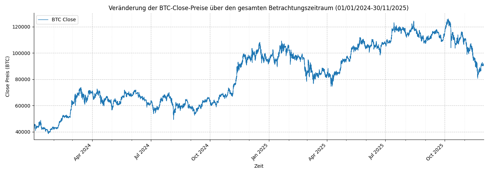

Im Vergleich zu stündlichen Daten zeigt sich, dass der Markt auch innerhalb eines übergeordneten Trends starken kurzfristigen Schwankungen unterliegt. Die höhere zeitliche Auflösung liefert somit eine geeignete Grundlage für die Vorhersage der Preisrichtung über einen Horizont von 60 Minuten.

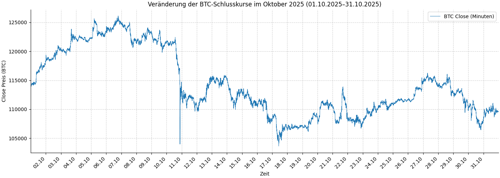

Zusätzlich wurde der Monat Oktober 2025 separat betrachtet, um die im Gesamtzeitraum dargestellten Entwicklungen anhand eines kürzeren, hochaufgelösten Ausschnitts zu konkretisieren. Der Minuten-Plot für Oktober zeigt, dass sich selbst innerhalb eines einzelnen Monats ausgeprägte Auf- und Abwärtsbewegungen sowie plötzliche Kursänderungen beobachten lassen.

Insbesondere kurzfristige Preisbewegungen und schnelle Richtungswechsel werden in dieser Detailansicht sichtbar. Die Oktober-Darstellung ergänzt damit die langfristige Betrachtung und unterstreicht die Relevanz von Minutendaten für die Vorhersage der Preisrichtung über 60 Minuten.

*2) Durchschnittlicher BTC-OHLC-Verlauf und Handelsvolumen pro Stunde (auf Basis des letzten Jahres)*

Wir untersuchen den durchschnittlichen BTC-OHLC-Verlauf für das letzte Jahr in stündlichen Intervallen. Zusätzlich wird das durchschnittliche Handelsvolumen pro Stunde dargestellt.

Das Diagramm besitzt zwei Y-Achsen:
- linke Achse: Preis (Eröffnung, Höchst-, Tief- und Schlusskurs)
- rechte Achse: durchschnittliches Handelsvolumen

Die X-Achse zeigt die Stunde des Tages, wobei jeder Punkt den Durchschnittswert dieser Stunde über das gesamte Jahr darstellt.

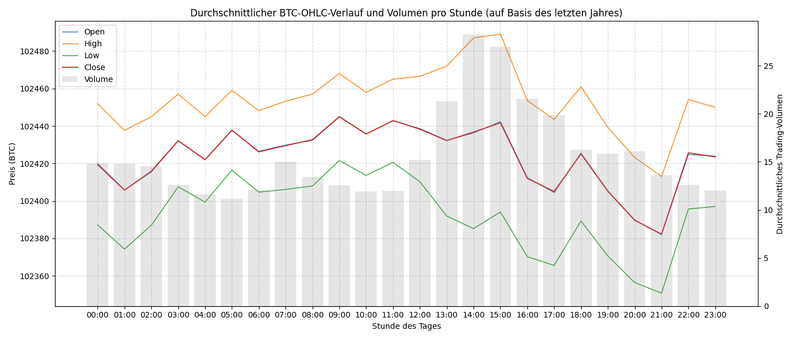

Es ist ersichtlich, dass sich die Eröffnungs- und Schlusskurse über den Tagesverlauf hinweg nahezu identisch entwickeln und nur sehr geringe Unterschiede zwischen den einzelnen Stunden aufweisen. Die Höchst- und Tiefstkurse zeigen hingegen zu bestimmten Tageszeiten deutlich größere Ausschläge, was auf eine erhöhte Volatilität in diesen Phasen hindeutet.

Das Handelsvolumen variiert im Tagesverlauf und steigt in einzelnen Stunden an, verläuft jedoch nicht durchgehend synchron mit den Preisschwankungen. Größere Hoch-Tief-Spannen deuten auf Phasen intensiverer Marktbewegungen hin.

*3) Durchschnittlicher stündlicher High–Low-Range von BTC (auf Basis des letzten Jahres)*

Das Diagramm zeigt die durchschnittliche Preisspanne zwischen Hoch- und Tiefkurs pro Stunde des Tages als Maß für die Volatilität.

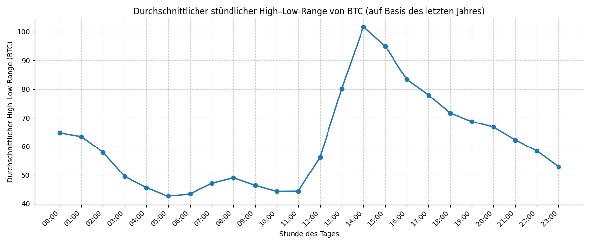

Es ist eine deutlich erkennbare Phase erhöhter Volatilität ab etwa 13:00 Uhr zu beobachten. In den darauffolgenden Stunden nimmt der durchschnittliche High–Low-Range stark zu und erreicht gegen 14:00 Uhr sein Tagesmaximum, bevor er in den späteren Nachmittags- und Abendstunden wieder abnimmt.

*4) Veränderung der BTC/ETH-Close-Preise über den letzten Tag*

Die Diagramme zeigen den durchschnittlichen stündlichen Schlusskurs (Close) für BTC und ETH über die letzten 30 Tage, 14 Tage und 7 Tage. Alle Diagramme haben zwei Y-Achsen:

- links: BTC Close

- rechts: ETH Close

Die Punkte geben jeweils den durchschnittlichen Schlusskurs pro Stunde innerhalb des betrachteten Zeitraums an.

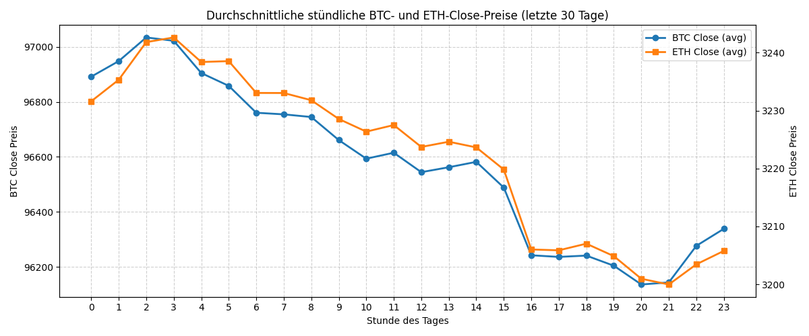

Letzte 30 Tage (stündlich):

BTC und ETH zeigen einen sehr ähnlichen Tagesverlauf mit weitgehend parallelen Kurven. Die Schwankungen sind relativ glatt, da kurzfristige Ausschläge durch die längere Aggregation gedämpft werden. Auffällig ist ein wiederkehrendes Tagesmuster mit höheren Kursen in den frühen Stunden und einem Rückgang am Nachmittag.

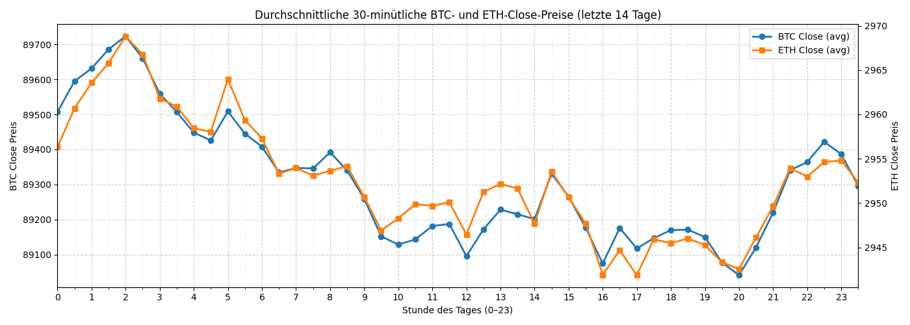

Letzte 14 Tage (30-minütig):

Die Kurven werden unruhiger und zeigen deutlich mehr kurzfristige Ausschläge. Zwar bewegen sich BTC und ETH weiterhin überwiegend synchron, jedoch treten häufiger kleinere Abweichungen auf. Dies deutet auf kurzfristige Marktimpulse hin, die in der 30-Tage-Sicht noch nivelliert waren.

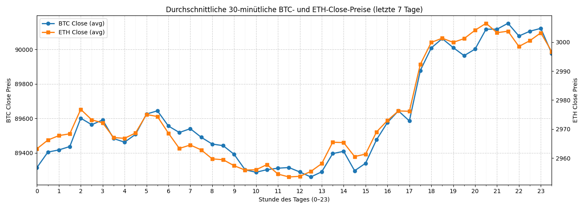

Letzte 7 Tage (30-minütig):

Die kurzfristige Dynamik ist am stärksten ausgeprägt. Es sind schnelle Richtungswechsel und steilere Bewegungen sichtbar, insbesondere in den Nachmittags- und Abendstunden. BTC und ETH reagieren weiterhin ähnlich, allerdings mit zeitlich leicht versetzten Bewegungen.

Über alle drei Zeiträume hinweg verlaufen BTC und ETH sehr ähnlich, was auf eine hohe Korrelation hinweist. Mit kürzeren Zeiträumen wird der Verlauf jedoch unruhiger, da kurzfristige Bewegungen stärker sichtbar werden. Die Diagramme zeigen damit, dass feinere Zeitauflösungen zusätzliche Marktdynamiken offenlegen und ETH ein sinnvolles ergänzendes Signal zur Beschreibung der Marktbewegungen darstellt.

*5) Korrelation zwischen BTC und ETH (letzte 30 Tage)*

Das Streudiagramm zeigt eine sehr starke positive Korrelation zwischen den Schlusskursen von BTC und ETH in den letzten 30 Tagen.

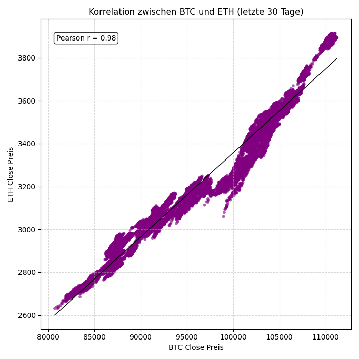

Der hohe Pearson-Korrelationskoeffizient von r = 0,98 bestätigt, dass sich beide Preise nahezu parallel bewegen und ETH die Marktbewegungen von BTC eng widerspiegelt.

*6) Minütliche BTC-Preisänderungen nach Tageszeit (letztes Jahr)*

Das Diagramm zeigt die Verteilung der minütlichen Bitcoin-Preisänderungen für jede Stunde des Tages auf Basis des letzten Jahres.

- X-Achse: Stunde des Tages (0–23)
- Y-Achse: Stärke der Preisbewegung pro Minute

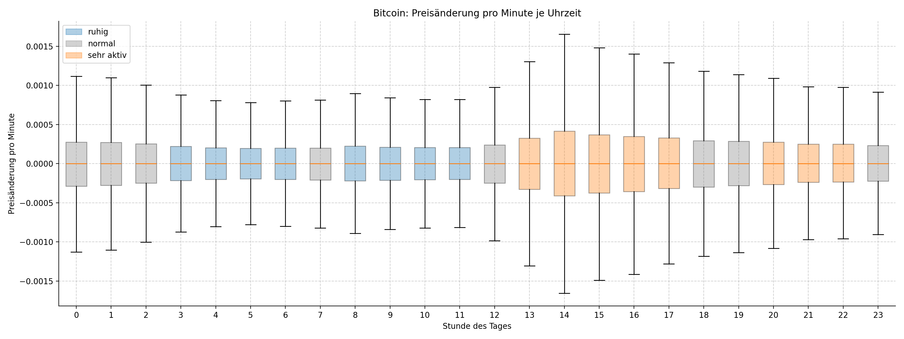

Die minütlichen Preisänderungen von Bitcoin liegen im Durchschnitt nahe bei null, unterscheiden sich jedoch deutlich in ihrer Streuung über den Tagesverlauf. Besonders zwischen 13:00 und 17:00 Uhr ist die Streuung am höchsten, was auf eine erhöhte kurzfristige Marktaktivität in diesem Zeitraum hinweist.

---

## Step 3 - Data Preparation (Pre-Split)

**Script**

- [scripts/03_pre_split_prep/features.py](scripts/03_pre_split_prep/features.py)
- [scripts/03_pre_split_prep/targets.py](scripts/03_pre_split_prep/targets.py)
- [scripts/03_pre_split_prep/main.py](scripts/03_pre_split_prep/main.py)
- [scripts/03_pre_split_prep/plot_features.py](scripts/03_pre_split_prep/plot_features.py)

### Features Berechnung

Da in diesem Experiment minütliche Kursdaten verwendet werden, wurde die Feature-Berechnung entsprechend auf kürzere Zeithorizonte angepasst. 
Ziel dieser Umstellung ist es, kurzfristige Marktbewegungen und Dynamiken präziser abzubilden, die in stündlichen Aggregationen teilweise verloren gehen.

Die neu gewählten Feature-Fenster sind:

- Returns: 5, 15, 30, 60 und 90 Minuten -> wird für BTC und ETH berechnet
- Exponential Moving Averages (EMA): 20 und 90 Minuten
- Momentum & Volatilität: RSI und ATR mit einem Fenster von 14 Minuten

Durch diese Feature-Auswahl werden sowohl sehr kurzfristige Preisänderungen (z. B. Momentum und Volatilität) als auch kurz- bis mittelfristige Trends erfasst. 
Dies ist insbesondere für die Vorhersage der Bitcoin-Trendrichtung auf einem kurzfristigen Prognosehorizont vorteilhaft, da das Modell schneller auf neue Marktinformationen reagieren kann und feinere zeitliche Muster lernt.

### Target Berechnung

Die Berechnung des Target-Wertes wurde ebenfalls angepasst. Anstelle der Vorhersage der Bitcoin-Trendrichtung für die nächste Stunde (60 Minuten) wird nun der Trend für die kommenden 30 Minuten prognostiziert.
Diese Anpassung ist sinnvoll, da sich innerhalb eines Zeitraums von einer Stunde starke Schwankungen und mehrere Richtungswechsel ergeben können, die eine eindeutige Trendzuordnung erschweren.
Ein kürzerer Prognosehorizont von 30 Minuten reduziert diese Vermischung unterschiedlicher Marktbewegungen und ermöglicht eine klarere und konsistentere Definition des Zieltrends.

Darüber hinaus wurde die Definition der Neutralzone angepasst. Ein Trend wird nun als neutral klassifiziert, wenn die Preisänderung von Bitcoin innerhalb von 30 Minuten unter 0,1 % liegt.
Im ersten Experiment wurde ein Trend als neutral betrachtet, wenn die Preisänderung geringer als 25 % des ATR-Wertes war.

### Visualisierung

**Plots**

*1) Trendverteilung des Bitcoin-Marktes im Zeitverlauf (2-Monats-Intervalle)*

Die Verteilung beträgt:

- Neutral: 34.875580
- UP: 32.995099
- Down: 32.129321

Auch hier sieht man, wie bereits beim ersten Experiment, dass alle Trendklassen ungefähr gleich verteilt sind über den gesamten Betrachtungszeitraum.

*2) Zusammenhang zwischen BTC- und ETH-Returns*

Es besteht weiterhin eine starke Korrelation zwischen den Return-Werten von Bitcoin und Ethereum.
Wobei der Pearson-Koeffizient von 0.79 geringer ist als beim ersten Experiment wo dieser 0.83 betrug.

*3) Rolling Lag-Korrelation zwischen BTC und BTC Returns (zeitversetzt um 30 Minuten)*

Es zeigt sich, dass keine signifikante Korrelation zwischen den aktuellen Bitcoin-Preisen und den Preisen vor 30 Minuten besteht. 
Daraus lässt sich ableiten, dass die Marktbewegungen der vergangenen 30 Minuten nur eine geringe Aussagekraft für die Entwicklung der folgenden 30 Minuten besitzen.

*4) Rolling Lag-Korrelation zwischen BTC und BTC Returns (zeitversetzt um 15 Minuten)*

Auch für die letzten 15 Minuten lässt sich keine signifikante Korrelation mit der Preisentwicklung in den folgenden 30 Minuten feststellen, was ebenfalls auf eine geringe kurzfristige Vorhersagbarkeit hinweist.

---

## Step 4 - Split Data

**Script**

[scripts/04_split_data/split.py](scripts/04_split_data/split.py)

Die Daten werden aufgeteilt in:
- Trainingsdaten (ca. 70% der Daten) - 2024-01-01 bis 2025-05-01
- Validierungsdaten (ca. 20% der Daten) - 2025-05-02 bis 2025-09-15
- Testdaten (ca. 10% der Daten) - 2025-09-16 bis 2025-11-30

---

## Step 5 - Post-Split Preparation

Dieser Schritt entspricht exakt dem gleichen Schritt im ersten Experiment.

---

## Step 6 - Feature Selection

**Script**

[scripts/06_feature_selection/main.py](scripts/06_feature_selection/main.py)

Wie im ersten Experiment werden aufgrund der starken Korrelationen folgende Features aus dem Datensatz gelöscht:
- open
- high
- low
- eth_close

Des Weiteren zeigte sich, dass die verschiedenen Ethereum-Return-Features keinen zusätzlichen Mehrwert für das Modell liefern, da sie stark mit den entsprechenden Bitcoin-Returns korrelieren und somit keine zusätzliche Information beitragen.
Aus diesem Grund werden auch folgende Features gelöscht:
- eth_return_5min
- eth_return_15min
- eth_return_60min
- eth_return_90min

---

## Step 7 - Model Training

**Script**

- [scripts/model_training/BTCSequenceDataset.py](scripts/model_training/BTCSequenceDataset.py)
- [scripts/model_training/LSTM_Pytorch.py](scripts/model_training/LSTM_Pytorch.py)
- [scripts/model_training/random_forest.py](scripts/model_training/random_forest.py)
- [scripts/model_training/random_loss.py](scripts/model_training/random_loss.py)

Auch im zweiten Experiment wird ein LSTM-Modell zur Vorhersage der Bitcoin-Trendrichtung eingesetzt. 
Durch die Verwendung von minütlichen Daten steht nun eine deutlich größere Datenmenge zur Verfügung, wodurch der Einsatz einer tieferen und leistungsfähigeren Modellarchitektur möglich ist.

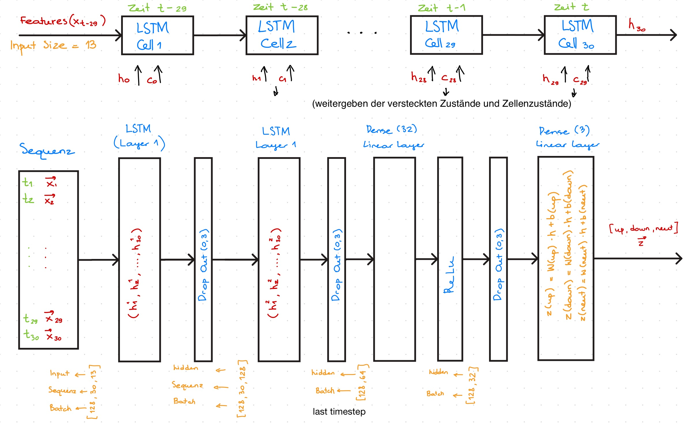
Das Modell besteht aus zwei aufeinanderfolgenden LSTM-Schichten mit 128 bzw. 64 Hidden Units, die zeitliche Abhängigkeiten in den Sequenzdaten erfassen.
Zur Reduktion von Overfitting werden nach jeder LSTM-Schicht Dropout-Layer eingesetzt.
Die extrahierten zeitlichen Merkmale werden anschließend über zwei vollständig verbundene Dense-Schichten weiterverarbeitet, wobei eine ReLU-Aktivierungsfunktion zur Einführung von Nichtlinearitäten verwendet wird.
Die finale Ausgabeschicht liefert die Klassenzugehörigkeit für drei Trendklassen (Up, Down, Neutral).

### Benutzte Parameter

| Parameter                 | Versuch 1          | Versuch 2        | Versuch 3        | Versuch 4        |
|---------------------------|--------------------|------------------|------------------|------------------|
| Anzahl der Layer          | 4                  | 3                | 5                | 2                | 
| hidden_size               | 128, 64, 32        | 64, 32           | 128, 64, 32      | 16               |
| Optimierungsalgorithmus   | SGD-Optimizer      | SGD-Optimizer    | SGD-Optimizer    | SGD-Optimizer    | 
| LOSS Funktion             | CrossEntropyLoss   | CrossEntropyLoss | CrossEntropyLoss | CrossEntropyLoss | 
| Sequence size             | 30                 | 30               | 30               | 20               | 
| Batch size                | 128                | 128              | 128              | 128              | 
| Dropout                   | 3 Mal je 0.3       | ein Mal 0.3      | 4 Mal je 0.3     | ein Mal 0.2      |  
| Learning Rate             | 0.001              | 0.001            | 0.001            | 0.001            | 
| Aktivierungsfunktion      | ReLu               | keine            | ReLu             | keine            |  
| ------------------------- | ------------------ | ---------------  | ---------------  | ---------------  |  
| Train Loss                | 1.0574             | 1.0554           | 1.0593           | 1.0570           |  
| Val Loss                  | 1.0357             | 1.0370           | 1.0364           | 1.0374           |  
| Accuracy                  | 0.462              | 0.462            | 0.464            | 0.463            | 
| F1-macro                  | 0.397              | 0.398            | 0.389            | 0.391            | 
| Recall-macro              | 0.411              | 0.412            | 0.409            | 0.409            | 

Zur Bestimmung einer geeigneten Modellarchitektur wurden mehrere Experimente mit unterschiedlich tiefen LSTM-Architekturen durchgeführt. 
Die Ergebnisse zeigen, dass tiefere Architekturen mit mehreren LSTM- und Dense-Schichten tendenziell bessere Leistungswerte erzielen als flachere Modelle, da sie komplexere zeitliche Muster in den Daten erfassen können.
Auf Basis dieser Ergebnisse wurde die Modellarchitektur aus Versuch 1 gewählt, da sie bei vergleichbarer Loss- und Accuracy-Werten eine ausgewogene Balance zwischen Modellkomplexität und Stabilität bietet und insgesamt die besten Gesamtmetriken (u. a. F1- und Recall-Werte) liefert.

*1.Versuch*

- In den ersten Epochen ist ein starker Abfall des Trainings- und Validierungs-Loss zu beobachten, was auf ein schnelles initiales Lernen des Modells hinweist.
- Ab etwa Epoche 5 stabilisieren sich beide Loss-Kurven und zeigen nur noch geringe Verbesserungen.
- Der Validierungs-Loss liegt durchgehend leicht unter dem Trainings-Loss, was auf eine stabile Generalisierung ohne starkes Overfitting hindeutet.

### Baseline-Modell - Random Forest

Als Baseline-Modell haben wir uns wie bereits beim ersten Experiment für das Random Forest Modell entschieden.
Es wurde die gleiche Architektur wie beim ersten Experiment verwendet.

| Parameter           | 
|---------------------|
| n_estimators=200    | 
| max_depth=None      | 
| min_samples_split=5 | 
| min_samples_leaf=2  | 

Als Ergebnis haben wir folgende Werte erhalten:

| Merkmal      | Random Forest | LSTM  |
|--------------|---------------|-------|
| Accuracy     | 0.417         | 0.462 | 
| F1-macro     | 0.386         | 0.397 |
| Recall-macro | 0.402         | 0.411 |

Das LSTM-Modell erzielt im Vergleich zum Random-Forest-Modell durchgängig bessere Ergebnisse in Accuracy, F1-macro und Recall-macro. 
Insbesondere die höheren F1- und Recall-Werte zeigen, dass das LSTM die Klassen ausgewogener und robuster vorhersagt. 
Insgesamt deutet der Vergleich darauf hin, dass das LSTM aufgrund seiner Fähigkeit, zeitliche Abhängigkeiten in den Sequenzdaten zu modellieren, besser für dieses Vorhersageproblem geeignet ist.

### Vergleich mit dem ersten Experiment 

| Parameter                             | Exp.1: LSTM | Exp.2: LSTM | Exp.1: Random Forest | Exp.2: Random Forest |
|---------------------------------------|-------------|-------------|----------------------|----------------------|
| Train Loss                            | 1.0702      | 1.0574      |                      |                      |  
| Val Loss                              | 1.087       | 1.0357      |                      |                      |  
| Accuracy                              | 0.397       | 0.462       | 0.355 (Diff: 0.042)  | 0.417 (Diff: 0.045)  | 
| F1-macro                              | 0.324       | 0.397       | 0.351 (Diff: -0.027) | 0.386 (Diff: 0.011)  | 
| Recall-macro                          | 0.377       | 0.411       | 0.360 (Diff: 0.017)  | 0.402 (Diff: 0.009)  | 
| Shannon-Entropie (Validation)         | 1.096       | 1.078       |                      |                      |
| Differenz Shannon Entropie & Val Loss | 0.009       | 0.0423      |                      |                      |

Die Ergebnisse zeigen eine deutliche Verbesserung vom ersten zum zweiten Experiment sowohl für das LSTM- als auch für das Random-Forest-Modell. 
Insbesondere beim LSTM sinken der Trainings- und Validierungs-Loss deutlich, während Accuracy, F1-macro und Recall-macro signifikant ansteigen, was auf eine bessere Modellanpassung und stabilere Klassifikation hinweist.
Im Vergleich der beiden Experimente zeigt sich, dass die Differenz zwischen Shannon-Entropie und Validierungs-Loss im zweiten Experiment deutlich größer ausfällt als im ersten, was auf konzentriertere und weniger unsichere Modellvorhersagen hindeutet.

Insgesamt zeigt der Vergleich, dass die im zweiten Experiment vorgenommenen Anpassungen (minütliche Daten, überarbeitete Feature- und Target-Definition) zu einer spürbaren Leistungssteigerung führen. 
Besonders das LSTM profitiert von diesen Änderungen und bestätigt sich damit als geeigneteres Modell für die kurzfristige Vorhersage der Bitcoin-Trendrichtung.

---

## Step 8 - Model Testing

**Script**

- [scripts/08_model_testing/lstm_testing.py](scripts/08_model_testing/lstm_testing.py)
- [scripts/08_model_testing/random_forest_testing.py](scripts/08_model_testing/random_forest_testing.py)

Das Testing erfolgt nach dem gleichen Prinzip wie im ersten Experiment. Dabei werden die besten Modellgewichte sowie die im ersten Trainingsversuch gewählte Modellarchitektur verwendet, um eine konsistente und vergleichbare Evaluation sicherzustellen.

**Ergebnisse**

| Merkmal                                | Exp.1: LSTM | Exp.2: LSTM |
|----------------------------------------|-------------|-------------|
| Accuracy                               | 0.3952      | 0.4446      |
| F1-macro                               | 0.2863      | 0.4254      |
| Recall-macro                           | 0.3651      | 0.4346      |
| Test Loss                              | 1.0907      | 1.0403      |
| Shannon-Entropie                       | 1.0948      | 1.0962      |
| Differenz Shannon Entropie & Test Loss | 0.0041      | 0.0559      |

Der Vergleich der Testergebnisse zeigt eine deutliche Verbesserung vom ersten zum zweiten Experiment. 
Während im ersten Experiment nur moderate Werte für Accuracy, F1-macro und Recall-macro erzielt werden, steigen diese Metriken im zweiten Experiment spürbar an, bei gleichzeitig deutlich geringerem Test-Loss. 
Dies deutet auf eine verbesserte Generalisierungsfähigkeit des Modells hin.

Zudem vergrößert sich im zweiten Experiment die Differenz zwischen Shannon-Entropie und Test-Loss erheblich, was auf stabilere und weniger unsichere Vorhersagen im Testdatensatz schließen lässt. 
Insgesamt bestätigen die Testergebnisse, dass die im zweiten Experiment vorgenommenen Anpassungen zu einem robusteren und leistungsfähigeren Modell führen.

*Exp.2 Testing*

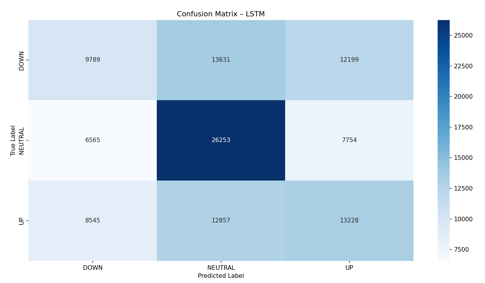

- Die Confusion Matrix zeigt, dass das LSTM-Modell im zweiten Experiment alle drei Klassen (DOWN, NEUTRAL, UP) aktiv vorhersagt, wobei insbesondere die Neutral-Klasse am häufigsten korrekt erkannt wird.
- Im Vergleich zum ersten Experiment sagt das Modell nun deutlich häufiger die Klasse DOWN voraus, während diese im ersten Versuch nahezu gar nicht vorhergesagt wurde.
- Gleichzeitig bestehen weiterhin Überschneidungen zwischen den Klassen, insbesondere zwischen UP und NEUTRAL, was auf die hohe Kurzfrist-Volatilität des Bitcoin-Marktes zurückzuführen ist.

*Exp.1 Testing*

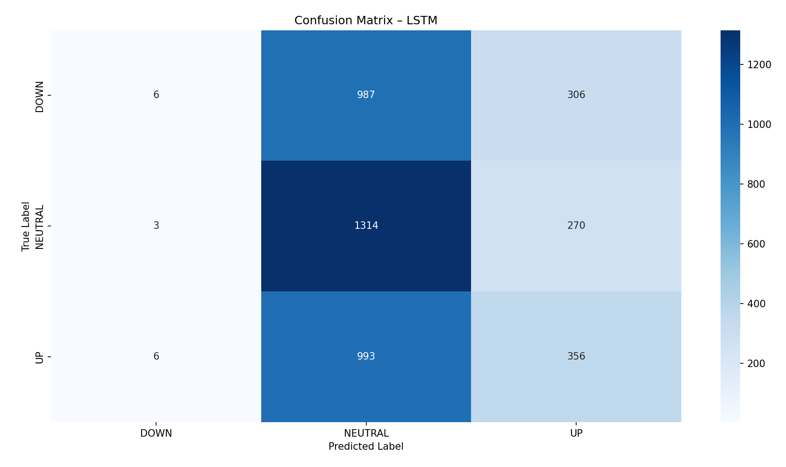

Beim ersten Experiment konnte das Modell den Down-Trend nicht vorhersagen

**Testing Random Forest**

| Merkmal      | Exp.1: Random Forest | Exp.1: LSTM           | Exp.2: Random Forest | Exp.2: LSTM           |
|--------------|----------------------|-----------------------|----------------------|-----------------------|
| Accuracy     | 0.326                | 0.3952 (Diff: 0.0692) | 0.4099               | 0.4446 (Diff: 0.0347) |
| F1-macro     | 0.273                | 0.2863 (Diff: 0.0133) | 0.4075               | 0.4254 (Diff: 0.0179) |
| Recall-macro | 0.344                | 0.3651 (Diff: 0.0211) | 0.4087               | 0.4346 (Diff: 0.0259) |

Der Vergleich der Testergebnisse zeigt, dass sowohl das Random-Forest- als auch das LSTM-Modell im zweiten Experiment deutlich bessere Leistungswerte erzielen als im ersten Experiment.
In beiden Experimenten übertrifft das LSTM-Modell den Random Forest konsistent in allen betrachteten Metriken, wobei der Leistungsabstand weiterhin gering ausfällt.
Insgesamt bestätigen die Ergebnisse, dass die Anpassungen im zweiten Experiment die Modellqualität signifikant steigern, wobei auch beim zweiten Experiment es keinen starken Unterschied zwischen Random Forest Modell und LSTM-Modell gibt.

---

## Step 9 - Deployment

### Backtesting traidng algorithms

**Script**

[scripts/09_model_deployment/backtesting.py](scripts/09_model_deployment/backtesting.py)

Um die Performance des Trading-Bots zu verbessern, wurde die Handelsstrategie angepasst.
Für das Backtesting wird der Zeitraum vom 2025-09-15 bis zum 30-11-2025 verwendet.
Es wird eine Entscheidung zum Trading getroffen alle 15 Minuten.
Für jede der drei Signalklassen wird die durchschnittliche Modellwahrscheinlichkeit über die letzten 15 Minuten bestimmt und als Entscheidungsgrundlage verwendet.

### Entry and Exit Points

*Entry Point*

Bedingungen:
- Wahrscheinlichkeit für UP am größten
- entweder keine Position vorhanden oder Position bereits auf dem Markt
- es wurde nicht mehr als 10 Mal hintereinander gekauft

Entry Preis: Schlusskurs der aktuellen Stunde

Entry Size: 

Die Größe des Kaufanteils richtet sich nach dem Vorkommen des UP-Signals in den letzten 15 Minuten.
- Wahrscheinlichkeit >= 0.5 -> Kauf für 20% der Buying power
- Wahrscheinlichkeit >= 0.4 -> Kauf für 15% der Buying power
- Wahrscheinlichkeit >= 0.3 -> Kauf für 10% der Buying power
- Wahrscheinlichkeit unter 0.3 -> Kauf für 5% der Buying power

*Exit Point*

Bedingungen:
- Wahrscheinlichkeit für DOWN am größten
- Position vorhanden und auf dem Markt

Die gesamte Position wird außerdem verkauft, wenn 10 Mal hintereinander ein HOLD-Signal kam und es häufiger Down-Vorhersagen gab als Up-Vorhersagen.
Ansonsten wird ein Buy-Signal gesendet. 

Exit Preis: Schlusskurs der aktuellen Stunde

Exit Volumen: 100% der Position 

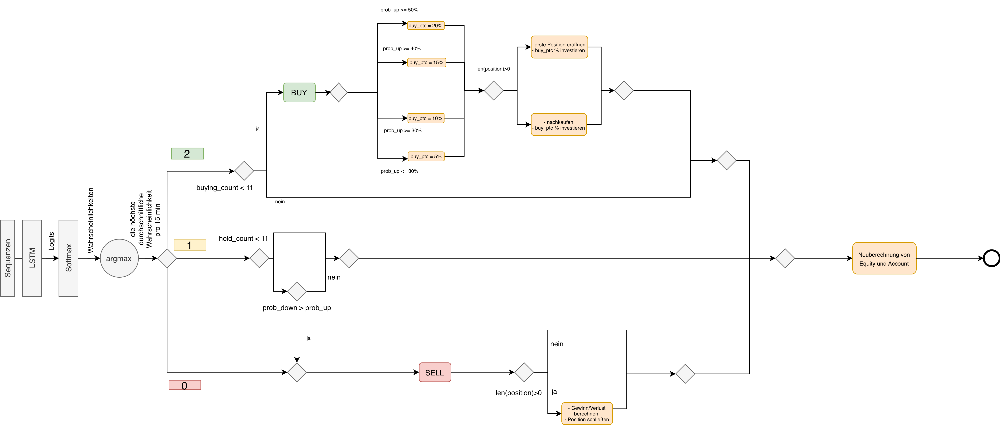

### Overall Performance

**Ergebnisse des Backtestings**

| Kennzahl               | Experiment 1 | Experiment 2 | Exp.1: BTC Close-Preis | Exp.2: BTC Close-Preis |
|------------------------|--------------|--------------|------------------------|------------------------|
| Startkapital           | 100 000,00   | 100 000,00   | 97 771,75              | 115 250, 01            |
| Finales Kapital        | 110 531,63   | 99 378,53    | 109 560,2              | 90 660, 45             |
| Absoluter Gewinn       | +10 531,63   | -621,47      | 11 788,45              | -24 589,56             |
| Relative Rendite       | +10,53 %     | -0,62        | +12,06                 | -21,34                 |
| Anzahl Trades-Signalen | 416          | 2307         |                        |                        |

In Experiment 1 steigt das eingesetzte Kapital von 100.000 € auf 110.531,63 €, was einer Rendite von +10,53 % entspricht.
Eine reine Buy-and-Hold-Strategie auf Basis des BTC-Close-Preises hätte im selben Zeitraum eine Rendite von +12,06 % erzielt.
Damit folgt die Handelsstrategie dem positiven Markttrend, bleibt jedoch leicht hinter der reinen Bitcoin-Performance zurück.

In Experiment 2 endet die Handelsstrategie bei einem Kapital von 99.378,53 €, was einem moderaten Verlust von −0,62 % entspricht.
Im Vergleich dazu verzeichnet der BTC-Close-Preis im selben Zeitraum einen deutlichen Rückgang von −21,34 %.
Obwohl das Experiment leicht negativ ausfällt, gelingt es der Strategie, das Kapital im Vergleich zu einem Buy-and-Hold-Ansatz deutlich besser zu schützen.

Insgesamt zeigt sich, dass die Handelsstrategie insbesondere in fallenden oder volatilen Marktphasen ihre Stärke ausspielt, indem sie Verluste begrenzt.
In stark steigenden Marktphasen hingegen kann sie mit einem passiven Bitcoin-Investment nicht vollständig mithalten, was auf einen eher defensiven, risikoreduzierenden Charakter der Strategie hinweist.

*1) Vergleich von Bitcoin-Preis und Portfolioentwicklung*

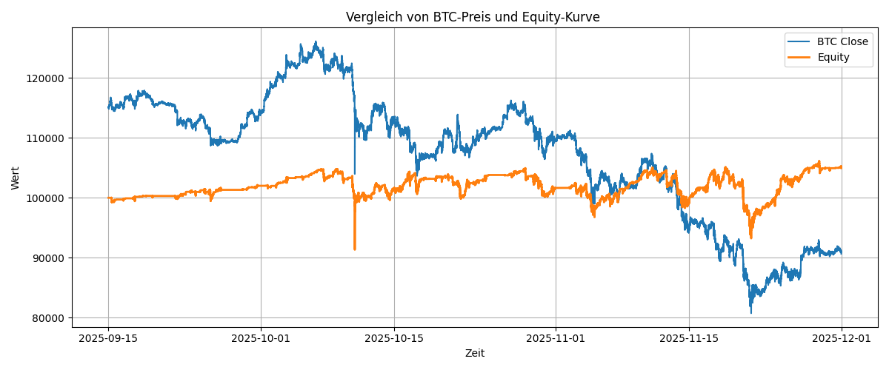

- Die Grafik zeigt, dass sich die Equity-Kurve zunehmend vom Bitcoin-Preisverlauf entkoppelt, insbesondere in Phasen starker Kursrückgänge.
- Während der Bitcoin-Preis im betrachteten Zeitraum deutlich fällt, bleibt die Equity relativ stabil, was auf eine wirksame Risikobegrenzung hindeutet.
- Kurzfristige Drawdowns der Equity sind sichtbar, fallen jedoch wesentlich geringer aus als die Verluste des Bitcoin-Preises, was die Robustheit der Handelsstrategie unter volatilen Marktbedingungen unterstreicht.
- 
*2) Vergleich von Bitcoin-Preis und Portfolioentwicklung (1. Experiment)*

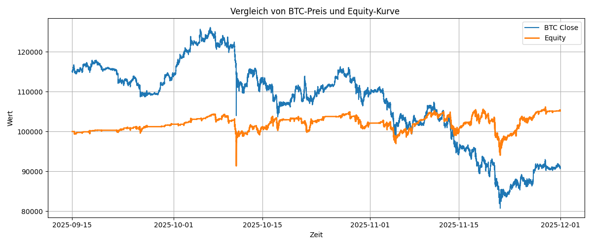

- Im ersten Experiment folgt die Equity-Kurve dem Bitcoin-Preisverlauf deutlich stärker als im zweiten Experiment, was auf eine geringere Fähigkeit zur Entkopplung vom Markt hindeutet.
- In Phasen steigender Bitcoin-Preise wächst die Equity zwar kontinuierlich, jedoch treten bei stärkeren Kursrückgängen spürbarere Drawdowns auf als im zweiten Experiment.
- Im Vergleich zur zweiten Grafik zeigt das erste Experiment eine weniger ausgeprägte Risikobegrenzung, während die verbesserte Strategie im zweiten Experiment Verluste in volatilen und fallenden Marktphasen deutlich besser abfedern kann.

### Paper trading

**Script**

[scripts/09_model_deployment/paper_trading.py](scripts/09_model_deployment/paper_trading.py)

### Aufsetzen von Paper trading

Das Paper-Trading-Setup basiert auf demselben Algorithmus wie im ersten Experiment.
Es wurden jedoch gezielte Anpassungen vorgenommen, um die Handelslogik konsistent mit dem im Backtesting verwendeten Ansatz umzusetzen.

Data acquisition:
- Nutzung der Binance API
- Daten werden einmal pro 15 Minuten geladen --> Trading Entscheidung wird alle 15 Minuten getroffen
- Verwendung der letzten 200 Minuten, um ausreichend Daten zu haben, um Features wie EMA zu berechnen

Feature Berechnung, Skalierung, Drop selected features:
- Nutzung der bereits fertigen Methode zur Berechnung der Features -> Pre-Split Preparation
- Nutzung des bereits gefitteten StandardScalers für die Skalierung -> Post-Split Preparation
- Löschung der Features, die bei der feature selection als redundant festgestellt wurden

Nutzung des LSTM-Modells:
- Die letzten 30 Minuten, die von der API zurückgegeben wurden, werden als Sequenz in das LSTM-Modell gegeben 
- 30 Minuten entsprechen der zuvor verwendeten Sequenzlänge 
- Die gespeicherten Modellgewichte werden für die Vorhersage verwendet
- Der vorhergesagte Trend bezieht sich darauf, wie sich der Bitcoin Close Preis in den nächsten 30 Minuten entwickeln wird

Das Setzen eines Orders folgt der gleichen Logik wie der Backtesting Algorithmus.

### Performance Paper trading

*1) Equity Kurve im Vergleich zum Bitcoin Close Preis*

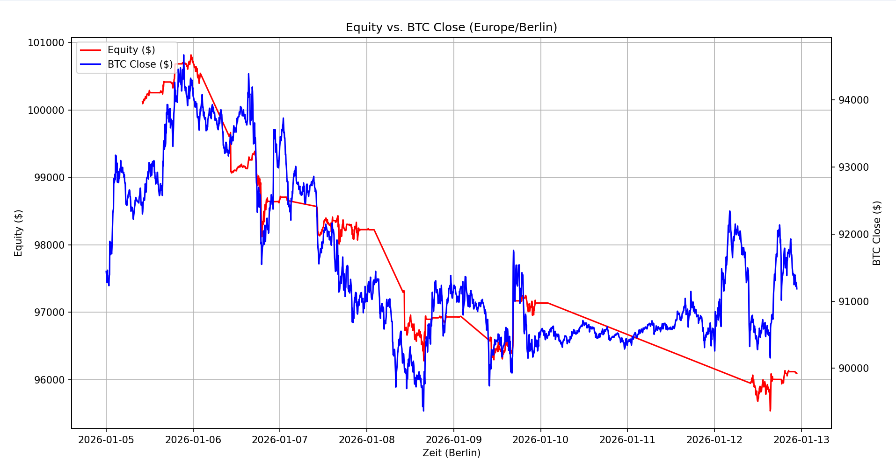

- Die Portfolio-Equity (rot) folgt in weiten Teilen der Bewegung des BTC-Preises (blau), was darauf hindeutet, dass die Trading-Strategie stark vom allgemeinen Markttrend abhängt.
- Bitcoin-Close Preis deutlich volatiler als Equity-Kurve
- Bei mehreren BTC-Preis-Erholungen (z.B. am 9., 10. und 12. Januar) zeigt die Equity keine entsprechenden Aufwärtsbewegungen, was darauf hinweist, dass die Trading-Strategie diese Bewegungen nicht erfolgreich erkennen konnte

Betrachteter Zeitraum: 05.01.2026 bis zum 13.01.2026

| Merkmal      | Equity              | BTC-Close         |
|--------------|---------------------|-------------------|
| Startkapital | $100,000.00         | $91,444.23        | 
| Endkapital   | $96,094.36          | $91,251.52        |
| Veränderung  | $-3,905.64 (-3.91%) | $-192.70 (-0.21%) |

Im betrachteten Zeitraum ist der Portfolio-Wert um 3,91 % gesunken, während der Bitcoin-Preis nur um 0,21 % fiel.
Dies zeigt, dass die Handelsstrategie deutlich schlechter als ein einfaches Halten von Bitcoin abgeschnitten hat und weiteres Optimierungspotenzial besteht.

SELL Orders: 37
BUY Orders: 171
TOTAL: 208

Es ist erwartungsgemäß, dass weniger Sell-Signale als Buy-Signale auftreten, da ein Sell-Signal nur ausgeführt werden kann, wenn zuvor eine Position aufgebaut wurde und daher nicht mehrfach hintereinander ausgelöst werden kann.
Im zweiten Experiment ist im Vergleich zum ersten eine deutliche Verbesserung erkennbar, da nun regelmäßig Sell-Orders gesetzt werden, während im ersten Experiment nahezu keine Sell-Orders ausgeführt wurden.

### Vergleich Paper Trading 

#### Erstes Experiment 

- Der Handel wurde am 15. Dezember um 10 Uhr gestartet.
- Der Handel wurde am 17. Dezember um 14:49 Uhr eingestellt.
- Auf dem Konto verblieben 195,16 $
- Danach wurden keine neuen Transaktionen mehr eröffnet
- Alle aufgezeichneten Signale waren BUY
- Es gab keine NEUTRAL-Signale, der Bot führte bis zum Stopp stündlich Aktionen durch

Im ersten Experiment lag ein grundlegender Fehler in der Handelsstrategie vor: Jedes Buy-Signal wurde ausgeführt, auch wenn mehrere Buy-Signale unmittelbar hintereinander auftraten. 
Dadurch wurde das verfügbare Kapital sehr schnell vollständig investiert, sodass der Bot anschließend keine weiteren Trades mehr ausführen konnte. 
Da zudem keine Sell-Signale ausgelöst wurden, konnte das in Bitcoin gebundene Kapital nicht wieder freigesetzt werden.

Aus diesem Grund konnte die Entwicklung des Portfolios nur über einen Zeitraum von etwa zehn Stunden analysiert werden. 
In diesem Zeitraum zeigte sich, dass sich die Equity-Kurve nahezu identisch zum Bitcoin-Close-Preis entwickelte. 
Die Handelsstrategie erzielte somit keinen Mehrwert gegenüber einer einfachen Buy-and-Hold-Strategie.

#### Zweites Experiment 

- Der Handel dauerte 8 Tage 
- Auf dem Konto verblieben am Ende des Betrachtungszeitraums 70 291,6 $
- Es gab Buy und Sell Signale als auch Hold-Phasen, wo keine Signale gesendet wurden

Das zweite Experiment zeigt, dass das Modell nun alle drei Klassen (UP, DOWN, Neutral) vorhersagt. 
In Kombination mit der angepassten Handelsstrategie führt dies dazu, dass der Bot über mehrere Tage hinweg stabil arbeiten kann, ohne sein gesamtes Kapital frühzeitig aufzubrauchen.

Dennoch ist zu beobachten, dass sich die Equity-Kurve in der ersten Hälfte des Betrachtungszeitraums ähnlich wie der Bitcoin-Close-Preis entwickelt. 
In der zweiten Hälfte fällt die Equity-Kurve jedoch, während sich der Bitcoin-Preis erholt und sogar ansteigt. 
Der Handelsbot schneidet in diesem Szenario somit schlechter ab als eine einfache Buy-and-Hold-Strategie.

### Fazit 